# What you will accomplish
* Create an on-demand backup job of an Amazon EC2 instance
* Use a backup plan to back up Amazon EC2 resources—using a backup plan within AWS Backup lets you automate your backups on a schedule
*	Add resources to an existing backup plan using tags

# Prerequisites
*	An [AWS account](https://aws.amazon.com/premiumsupport/knowledge-center/create-and-activate-aws-account/). For more information on using AWS Backup for the first time, view the [AWS Backup documentation](https://docs.aws.amazon.com/aws-backup/latest/devguide/setting-up.html).
*	One or more Amazon EC2 instances. You can refer to the [Amazon EC2 pricing](https://aws.amazon.com/ec2/pricing/) page for more details. For AWS Backup pricing, refer to the [AWS Backup pricing page](https://aws.amazon.com/backup/pricing/). 
*	IAM roles used by AWS Backup to create a backup of the Amazon EC2 instance. 
    * If a subsequent role is not created, then the default IAM role can be used— AWSBackupDefaultRole.

# Implementation
In this tutorial, you will learn how to create an on-demand backup job of an Amazon EC2 instance. Then, you will use a backup plan to protect EC2 resources. Using a backup plan within AWS Backup lets you automate backups using tags. 

## Step 1: Go to the AWS Backup console
a. Log in to the [AWS Management Console](https://console.aws.amazon.com/), and open the [AWS Backup console](https://console.aws.amazon.com/backup).

## Step 2: Configure an on-demand AWS Backup job of an Amazon EC2 instance
**2.1 — Configure the services used with AWS Backup**

a. In the navigation pane on the left side of the [AWS Backup console](https://console.aws.amazon.com/backup), under **My account**, choose **Settings**.
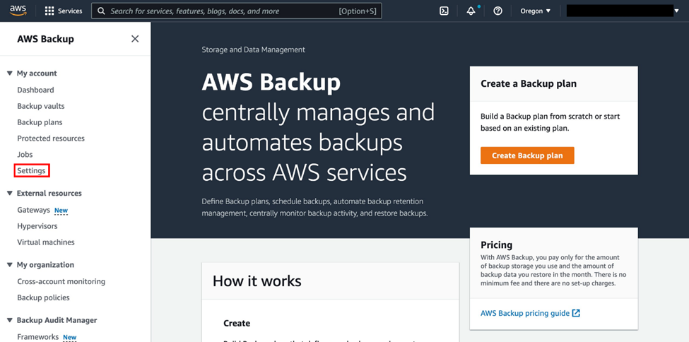

b. On the **Service opt-in** page, choose **Configure resources**.
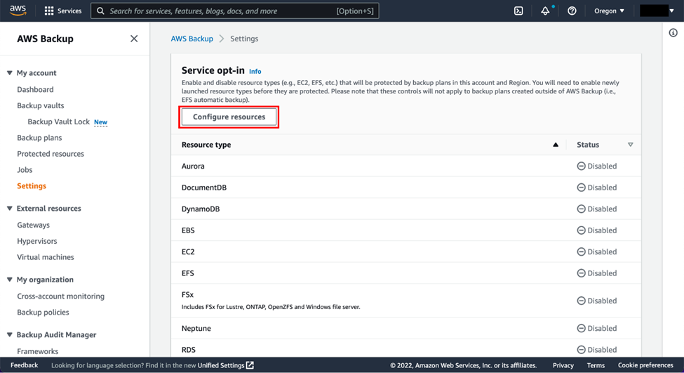

c. On the **Configure resources** page, use the toggle switches to enable or disable the services used with AWS Backup. In this case, select **EC2**. Choose **Confirm** when your services are configured.
    
* AWS resources that you're backing up should be in the Region you are using for this tutorial, and resources must all be in the same AWS Region (however, see step 3.2 for information on Cross-Region Copy). This tutorial uses the US West (Oregon) Region (us-west-1).
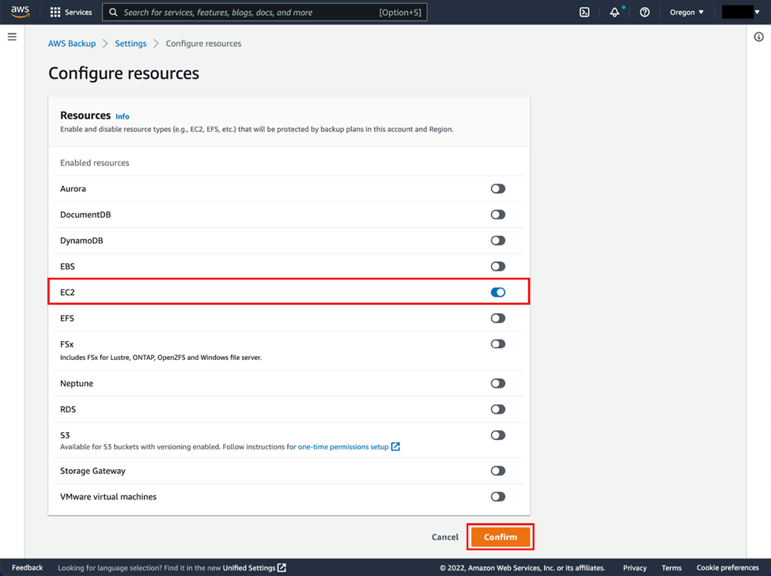
 
**2.2 — Create an on-demand backup job of an Amazon EC2 instance**

d. Back in the [AWS Backup console](https://console.aws.amazon.com/backup), under **My account** in the left navigation pane, select **Protected resources**.
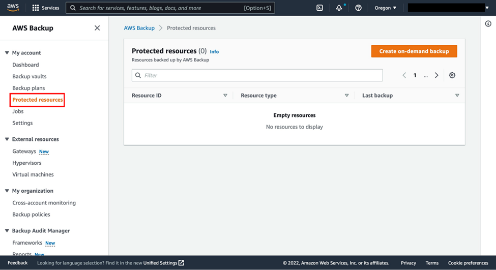

e. From the dashboard, choose the **Create on-demand backup button**.
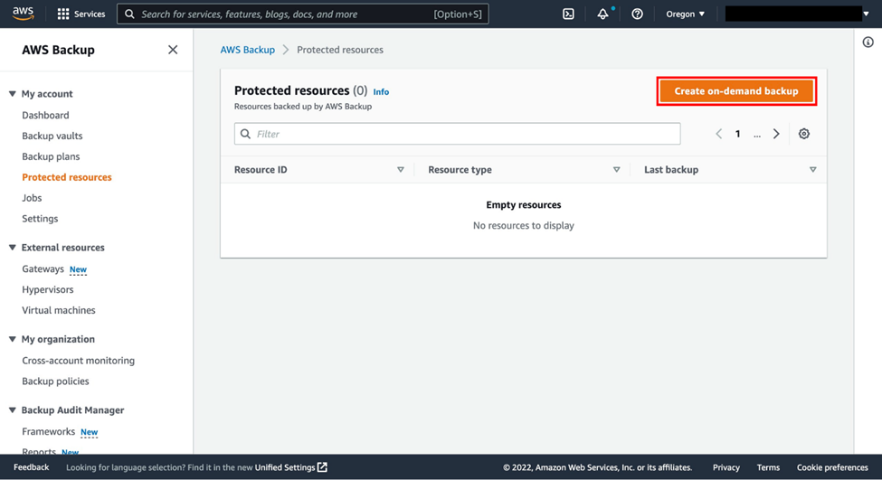

f. On the **Create on-demand backup** page, choose the following options:

* Select the resource type that you want to back up; for example, choose **EC2** for Amazon EC2.
* Choose the **Instance ID** of the EC2 resource that you want to protect.
* Ensure that **Create backup now** is selected. This initiates your backup job immediately and enables you to see your saved resource sooner on the **Protected resources** page.
* Select the desired **retention period**. AWS Backup automatically deletes your backups at the end of this period to save storage costs for you.
* Choose an existing backup vault. Choosing **Create new Backup vault** opens a new page to create a vault and then returns you to the **Create on-demand backup** page when you are finished.
* Under **IAM role**, choose **Default role**.

    * Note: If the AWS Backup Default role is not present in your account, then an AWS Backup Default role is created with the correct permissions.
* Choose the **Create on-demand backup** button. This takes you to the Jobs page, where you will see a list of jobs.
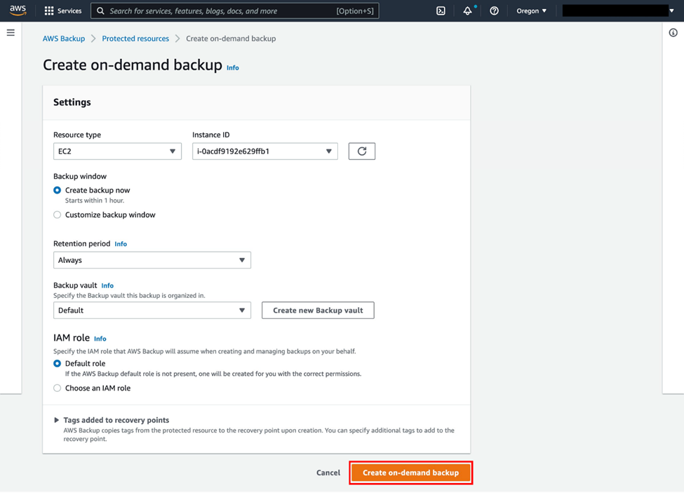

g. Choose the **Backup job ID** for the resource that you chose to back up to see the details of that job.

## Step 3: Configure an automatic AWS Backup job of an Amazon EC2 instance
**3.1 — Configure the services used with AWS Backup**

a. In the left navigation pane in the [AWS Backup console](https://console.aws.amazon.com/backup), under **My account**, choose **Settings**.
b. On the **Service opt-in** page, choose **Configure resources**.
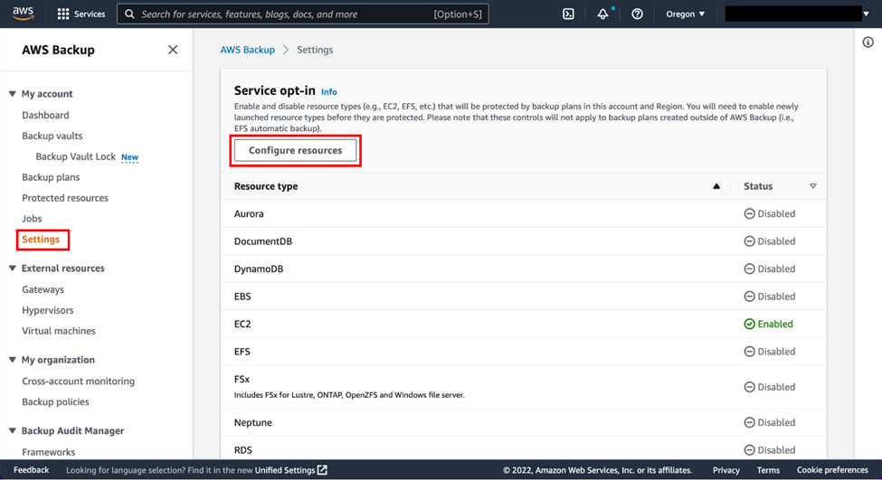

c. On the **Configure resources** page, use the toggle switches to enable or disable the services used with AWS Backup. Choose **Confirm** when your services are configured.
* AWS resources that you're backing up should be in the Region you are using for this tutorial, and resources must all be in the same AWS Region (however, see step 3.2 for information on Cross-Region Copy). This tutorial uses the US West (Oregon) Region (us-west-1).
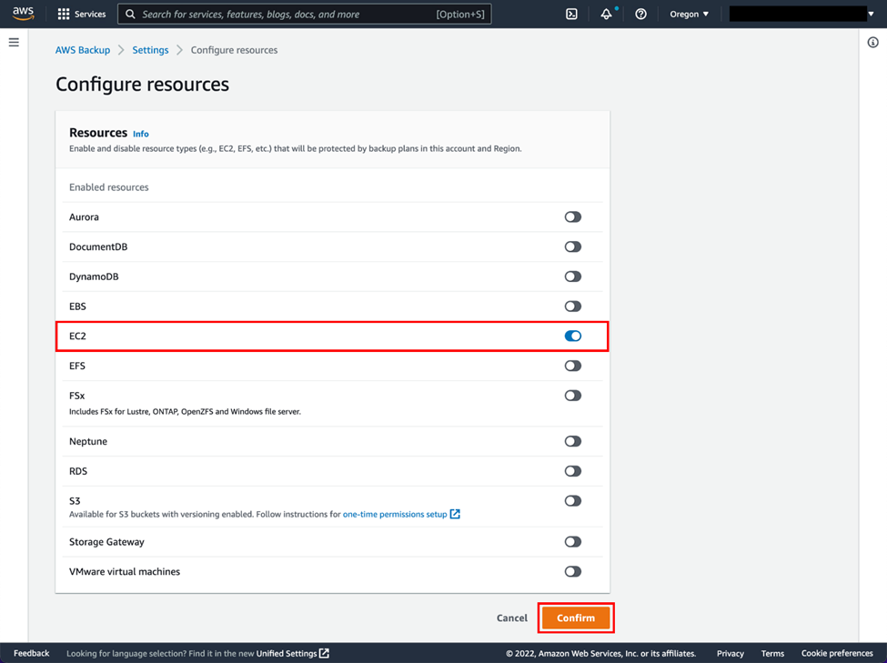
 
**3.2 — Configure a backup plan for an Amazon EC2 instance**

d. In the [AWS Backup console](https://console.aws.amazon.com/backup), select **Backup plans** in the left navigation pane under **My account**, and then **Create backup plan**.
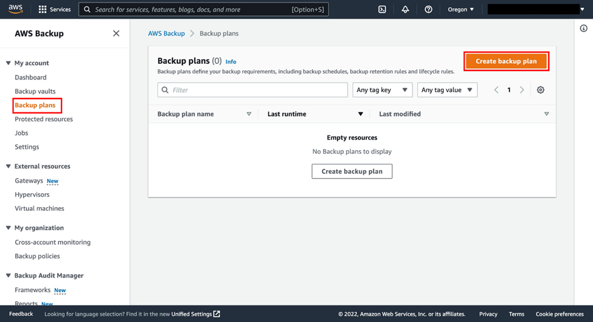

e. AWS Backup provides three ways to get started using backup plans, but for this tutorial, select **Build a new plan**:
* **Start with a template** — You can create a new backup plan based on a template provided by AWS Backup. Be aware that backup plans created by AWS Backup are based on backup best practices and common backup policy configurations. When you select an existing backup plan to start from, the configurations from that backup plan are automatically populated for your new backup plan. You can then change any of these configurations according to your backup requirements.
* **Build a new plan** — You can create a new backup plan by specifying each of the backup configuration details, as described in the next section. You can choose from the recommended default configurations.
* **Define a plan using JSON** — You can modify the JSON expression of an existing backup plan or create a new expression.

f. **Backup plan name** — You must provide a unique backup plan name. If you try to create a backup plan that is identical to an existing plan, you get an AlreadyExistsException error. For this tutorial, enter **EC2-webapp**.
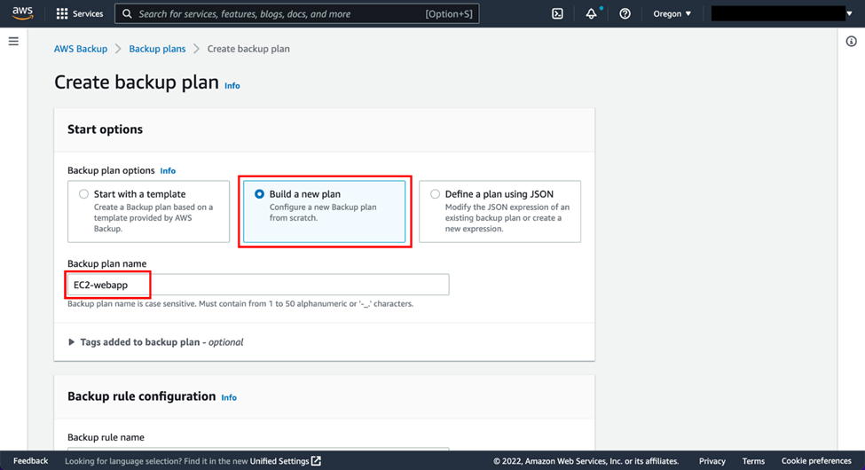

g. **Backup rule name** — Backup plans are composed of one or more backup rules. Backup rule names are case sensitive. They must contain from 1 to 63 alphanumeric characters or hyphens. For this tutorial, enter **EC2-Dailies**.

h. **Backup vault** — A backup vault is a container to organize your backups in. Backups created by a backup rule are organized in the backup vault that you specify in the backup rule. You can use backup vaults to set the AWS Key Management Service (AWS KMS) encryption key that is used to encrypt backups in the backup vault and to control access to the backups in the backup vault. You can also add tags to backup vaults to help you organize them. If you don't want to use the default vault, you can create your own.
* **Create new Backup vault** — Instead of using the default backup vault that is automatically created for you in the AWS Backup console, you can create specific backup vaults to save and organize groups of backups in the same vault.

    i)    To create a backup vault, choose **Create new Backup vault**.
    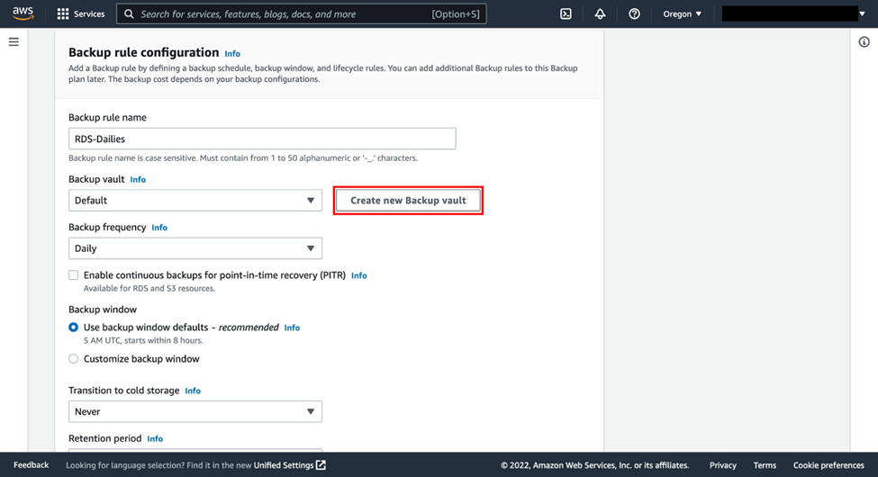
    ii) Enter a name for your backup vault. You can name your vault to reflect what you will store in it, or to make it easier to search for the backups you need. For example, you could name it *FinancialBackups*.

    iii) Select an AWS KMS key. You can use either a key that you already created or select the default AWS Backup KMS key.

    iv) Optionally, add tags that will help you search for and identify your backup vault.

    v) Choose the **Create Backup vault** button.
    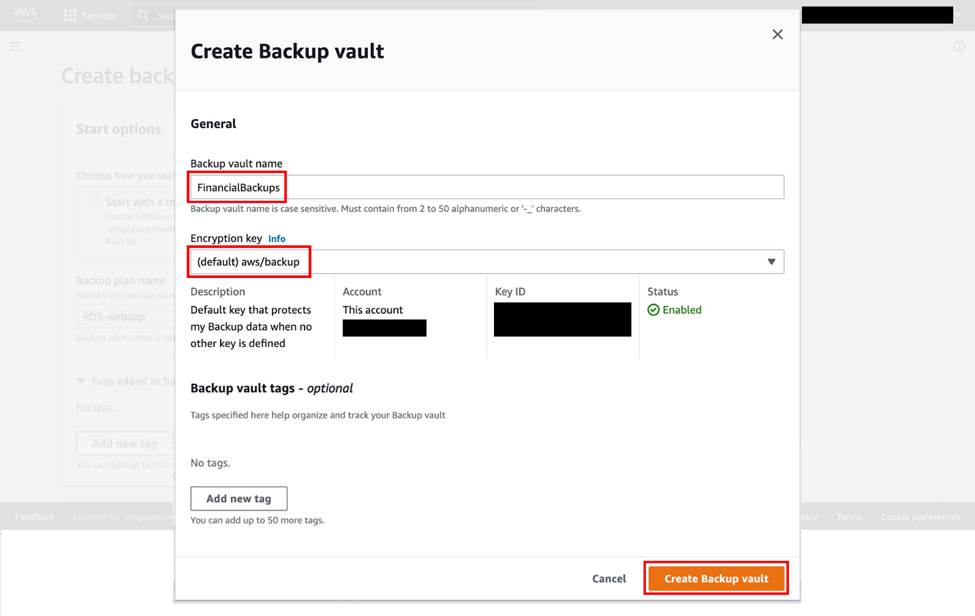
 
i. **Backup frequency** — The backup frequency determines how often a backup is created. You can choose a frequency of every 12 hours, daily, weekly, or monthly. When selecting weekly, you can specify which days of the week you want backups to be taken. When selecting monthly, you can choose a specific day of the month.

j. **Enable continuous backups for point-in-time recovery** — With continuous backups, you can perform point-in-time restores (PITRs) by choosing when to restore, down to the second. The most time that can elapse between the current state of your workload and your most recent point-in-time restore is 5 minutes. You can store continuous backups for up to 35 days. If you do not enable continuous backups, AWS Backup takes snapshot backups for you.

k. **Backup window** — Backup windows consist of the time that the backup window begins and the duration of the window in hours. The default backup window is set to start at 5 AM UTC (Coordinated Universal Time) and lasts 8 hours.
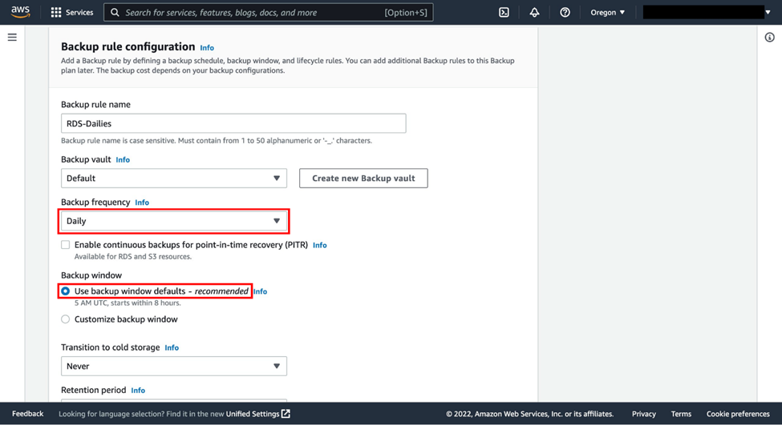
 
l. **Transition to cold storage** — Currently, only Amazon Elastic File System (Amazon EFS) backups can be transitioned to cold storage. The cold storage expression is ignored for the backups of Amazon Elastic Block Store (Amazon EBS), Amazon Relational Database Service (Amazon RDS), Amazon Aurora, Amazon DynamoDB, and AWS Storage Gateway.
 
m. Retention period — AWS Backup automatically deletes your backups at the end of this period to save storage costs for you. AWS Backup can retain snapshots between 1 day and 100 years (or indefinitely, if you do not enter a retention period), and continuous backups between 1 and 35 days.
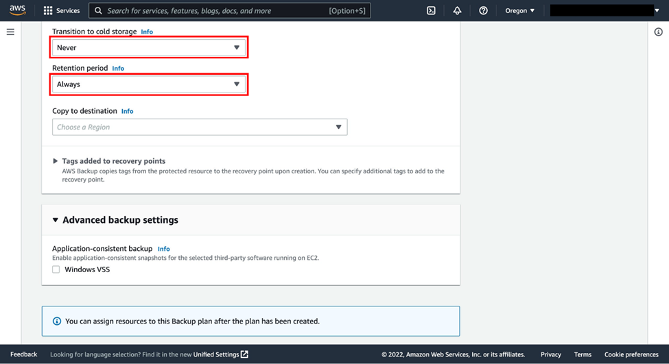
 
n. **Copy to destination** — As part of your backup plan, you can optionally create a backup copy in another AWS Region. Using AWS Backup, you can copy backups to multiple AWS Regions on-demand, or automatically as part of a scheduled backup plan. Cross-Region Replication (CRR) is particularly valuable if you have business continuity or compliance requirements to store backups a minimum distance away from your production data. When you define a backup copy, you configure the following options:
* Copy to destination — The destination Region for the backup copy.
* Destination Backup vault — The destination backup vault for the copy.
* (Advanced Settings) Transition to cold storage
* (Advanced Settings) Retention period

    * Note: Cross-Region Copy incurs additional data transfer costs. You can refer to the [AWS Backup pricing](https://aws.amazon.com/backup/pricing/) page for more information.
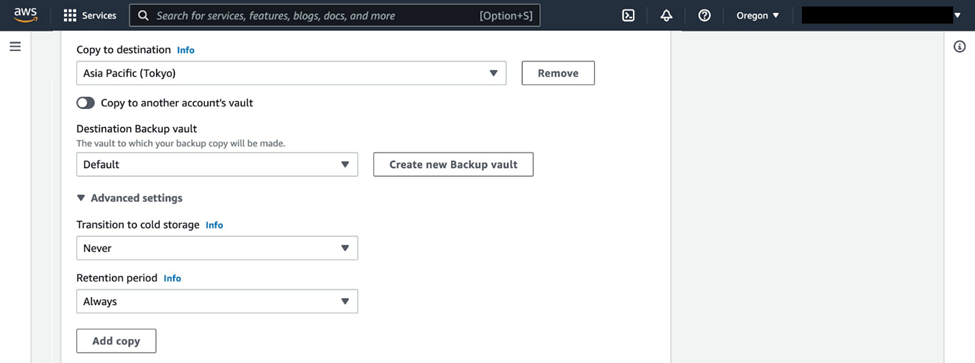
 
o. **Tags added to recovery points** — The tags that you list here are automatically added to backups when they are created.

p. **Advanced backup settings** — Enables application-consistent backups for third-party applications that are running on Amazon EC2 instances. Currently, AWS Backup supports Windows VSS backups. This is only applicable for Windows EC2 Instances running SQL Server or Exchange databases.

q. Choose **Create plan**.
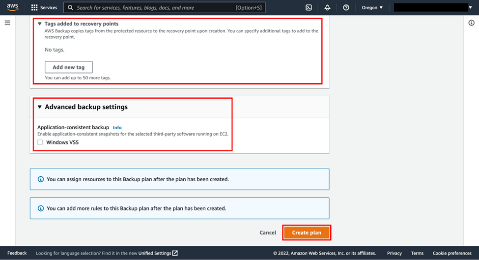

**3.3 — Assign resources to the backup plan**
 
When you assign a resource to a backup plan, that resource is backed up automatically according to the backup plan. The backups for that resource are managed according to the backup plan. You can assign resources using tags or resource IDs. Using tags to assign resources is a simple and scalable way to back up multiple resources.

a. Select the created backup plan and choose the **Assign resources** button.
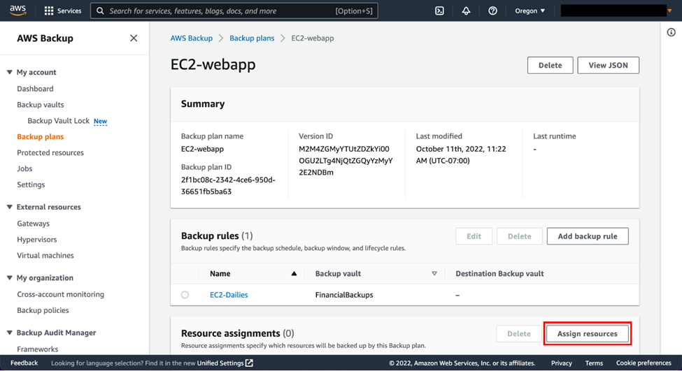
 
b. **Resource assignment name** — Provide a resource assignment name.
c. **IAM role** — When creating a tag-based backup plan, if you choose a role other than **Default role**, make sure that it has the necessary permissions to back up all tagged resources. AWS Backup tries to process all resources with the selected tags. If it encounters a resource that it doesn't have permission to access, the backup plan fails.
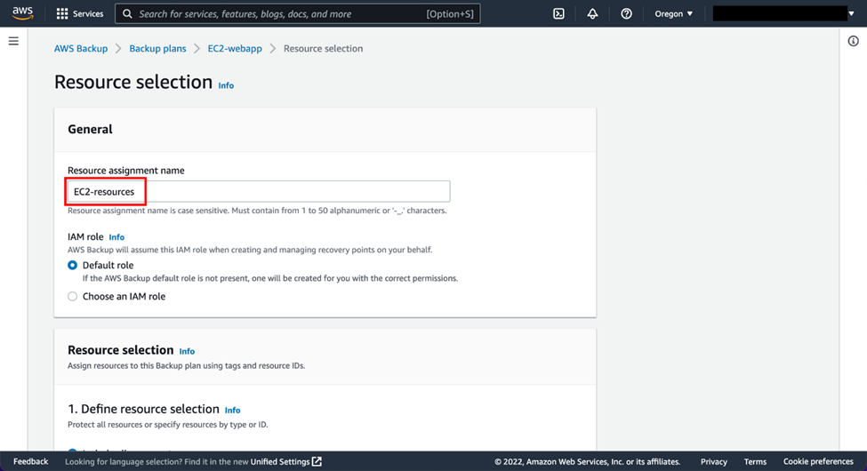

d. **Define resource selection** — You can choose to include all resource types or specific resource types.

e. For resource ID-based assignment, select **Resource type** and the name of the resource.

f. To exclude specific resource IDs, select **Resource type** and the name of the resource.
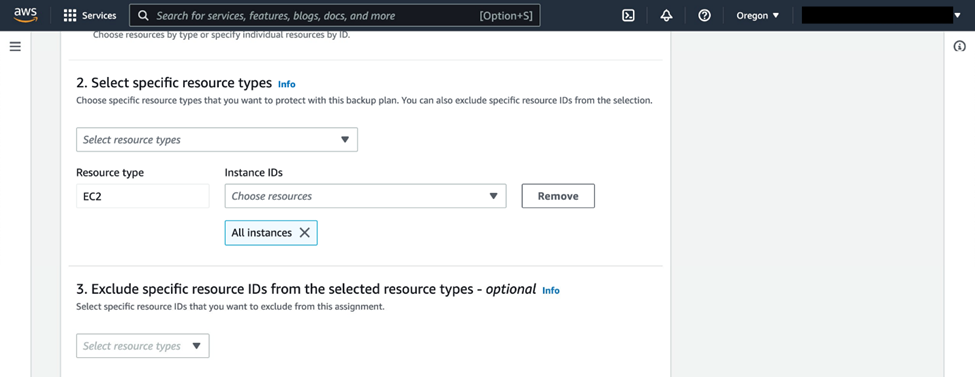

g. For tags-based resource assignment, provide the key-value pair of the Amazon EC2 instance.

h. Choose the **Resource selection** button to assign the resources to the backup plan.

i. Navigate to the [AWS Backup ](https://console.aws.amazon.com/backup). The backup jobs will be seen under **Jobs**.

j. A backup, or recovery point, represents the content of a resource, such as an Amazon EC2 instance or Amazon RDS database, at a specified time. *Recovery point *is a term that refers generally to the different backups in AWS services, such as Amazon EBS snapshots and Amazon RDS backups. In AWS Backup, recovery points are saved in backup vaults, which you can organize according to your business needs. Each recovery point has a unique ID.
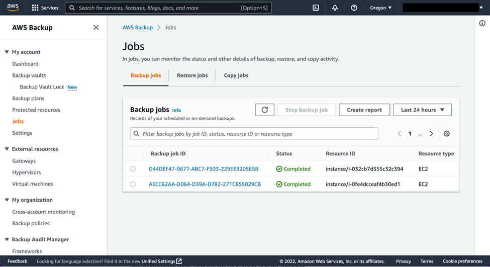

## Step 4: Restore an Amazon EC2 instance using AWS Backup
a. Navigate to the backup vault that was selected in the backup plan and select the latest completed backup.

b. To restore the EC2 instance, select the recovery point ARN and choose **Restore**.

c. The restore of the ARN will bring you to a **Restore backup** screen that will have the configurations for the EC2 instance using the backed-up AMI and all the attached EBS volumes.

* In the Network settings pane, accept the defaults or specify the options for the **Instance type, Virtual Private Cloud (VPC), Subnet, Security groups**, and **Instance IAM role** settings.
* This example proceeds with no IAM role. The IAM role can be applied to the EC2 instance after the restore process is completed.

    i. To successfully do a restore with the original instance profile, you must edit the restore policy. If you apply an instance profile during the restore, you have to update the operator role and add the PassRole permissions of the underlying instance profile role to Amazon EC2. The default service role created by AWS Backup manages creating and restoring backups. It has two managed policies: AWSBackupServiceRolePolicyForBackup and AWSBackupServiceRolePolicyForRestores. It also allows “Action”: “[iam:PassRole](https://docs.aws.amazon.com/IAM/latest/UserGuide/id_roles_use_passrole.html)” to launch EC2 instances as part of a restore.
 
d. In the **Restore role** pane, accept the **Default role** or **Choose an IAM role** to specify the IAM role that AWS Backup will assume for this restore.

e. In the **Advanced settings** pane, accept the defaults or specify the options for **Shutdown behavior, Stop - Hibernate behavior, Placement group, T2/T3 Unlimited, Tenancy,** and **User data** settings. This section is used to customize shutdown and hibernation behavior, termination protection, placement groups, tenancy, and other advanced settings.

f. AWS Backup will use the SSH key pair used at the time of backup to automatically perform your restore.

g. After specifying all of your settings, choose **Restore backup**. The **Restore jobs** pane will appear, and a message at the top of the page will provide information about the restore job.

h. Check for your restored backup job under **Restore jobs** in the the [AWS Backup console](https://console.aws.amazon.com/backup).
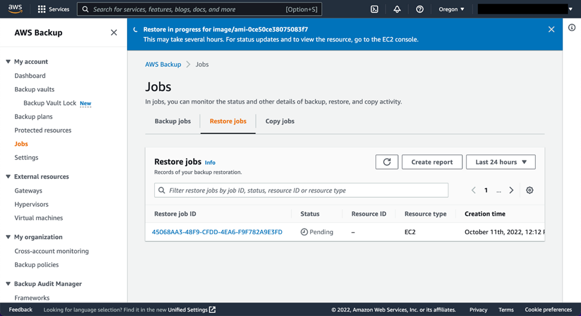

i. Once the job status appears as completed, navigate to the [Amazon EC2 console](https://console.aws.amazon.com/ec2/v2/home) and select **Instances** in the left navigation pane to see the restored EC2 instance. The EC2 instance is restored using the backup of the AMI and the attached EBS volume.

## Step 5: Next steps
You can now connect to the public IP address if you restored your Amazon EC2 instance using SSH.

## Conclusion
Congratulations! You have created a backup of an Amazon EC2 instance and performed a restore using AWS Backup.

*From AWS documentation.*