## Table of content
* Step 1: Create S3 Bucket with your Godaddy domain name (set public access)
* Step 2: Enable static website hosting
* Step 3: Upload your static website files into your bucket
* Step 4: Add a bucket policy that makes your bucket content publicly available
* Step 5: Create a Route 53 public hosted zone
* Step 6: Create an A record into our hosted zone
* step 7: Update your Godaddy DNS NS records with the same NS records from your AWS Route 53 hosted zone
* Step 8: Request TLS certificate in ACM
* Step 9: Set up my CloudFront distribution to define how website content will be delivered 
* Step 10: Create a Route 53 A record as an alias for your CloudFront distribution


## Prerequisites
1. A **domain name** purchased from Godaddy: *in my case I've purchased the domain conceptix-art.com*
2. A **Static website content**: *In my case, I've downloaded a free html template from tooplate.com and started editing the html code*
3. An AWS account to be able to create and configure S3 bucket, hosted zone, etc...


# Step 1: Create S3 Bucket with your Godaddy domain name (set public access)

1. Log in to the **AWS Management Console**: Go to the AWS Management Console (https://console.aws.amazon.com/) and log in to your AWS account.

2. Navigate to the **S3 service**: Once logged in, you will be in the AWS Management Console dashboard. Search for "S3" in the services search bar or find and click on "S3" under the "Storage" category.

3. Click on **"Create bucket"**: In the S3 dashboard, click on the "Create bucket" button to start creating a new bucket.

4. Enter **bucket details**: In the "Create bucket" dialog, you need to provide the following details:

    a. **Bucket name**: Enter a unique name for your bucket; in this case use your domain name(*www.conceptix-art*).

    b. **Region**: Choose the region where you want to create the bucket; in this case it's *us-east-1*.

    c. Keep the **ACLs disabled** as recommended.

    d. Disable the **Block all public access** option to allow public access to the bucket and **aknowledge** to confirm the public permissions.

    e. **Enable** or keep the bucket versioning **disabled**.

    f. Leave the other options as default and click on **Create bucket**.

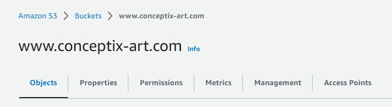

# Step 2: Enable static website hosting

1. Click on your bucket
2. Under the **Properties** tab, scroll down to the end of the page and click **Edit** next to **Static Website Hosting**
3. Click on **Enable**
4. Leave the *Hosting type* as **Host a static website**
5. In the *Index document* field, specify your website home file name: Mine is **index.html**
6. If you have one, you can specify your **error document** or your redirection rules (they're optional).


# Step 3: Upload your static website files into your bucket

1. In your bucket, click **Upload**
2. Click **Add folder** and make sure you upload all necessary files and folders to the root of your bucket
3. Click on **Upload**.

Note: You can do this using the AWS CLI by typing commands such as:
```
$ cd local-static-website-folder
$ aws s3 sync . s3://www.conceptix-art.com
```


# Step 4: Add a bucket policy that makes your bucket content publicly available

1. Click on your bucket
2. Under the **Permissions** tab, scroll down and click **Edit** next to **Bucket policy**
3. Provide a similar policy to the following where you'll change the resource line depending on your bucket name:

```json
{
    "Version": "2012-10-17",
    "Statement": [
        {
            "Sid": "PublicReadGetObject",
            "Effect": "Allow",
            "Principal": "*",
            "Action": "s3:GetObject",
            "Resource": "arn:aws:s3:::www.conceptix-art.com/*"
        }
    ]
}
```
4. Click on **Save changes**

Your objects are now publicly accessible.

```
Note: The pricing for a public Amazon S3 bucket in AWS depends on the following factors:

a. Storage Pricing:
 - Standard Storage: $0.023 per GB per month for the first 50 TB.
 - Infrequent Access (IA) Storage: $0.0125 per GB per month for the first 50 TB.
 - One Zone-Infrequent Access (Z-IA) Storage: $0.01 per GB per month for the first 50 TB.
 - Glacier Storage: $0.004 per GB per month for the first 50 TB.

b. Data Transfer Pricing:
 - Data transfer from the S3 bucket to the internet: Pricing varies based on the data transfer region and amount of data transferred. You can refer to the AWS S3 pricing page for detailed information.

c. Requests Pricing:
 - PUT, COPY, POST, or LIST requests: $0.005 per 1,000 requests.
 - GET and all other requests: $0.0004 per 1,000 requests.

d. Additional Features:
 - Cross-Region Replication, Transfer Acceleration, and other optional features have their own associated costs. Refer to the AWS S3 pricing page for specific details.
```

# Step 5: Create a Route 53 public hosted zone

1. Navigate to the **Route 53 service**
2. In the Route 53 dashboard, click **Hosted zones** from the left pane
3. Click on **Create hosted zone** and set the details as following:
    
    a. **Domain name**: Provide your domain name without the **www**

    b. Optional description

    c. **Type** must be **Public hosted zone**

    d. Optionally add a tag

    e. Click **Create hosted zone**

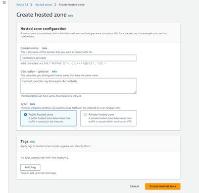


# Step 6: Create an A record into our hosted zone

1. Click your newly created hosted zone
2. Under the **Records** tab, click **Create record** and provide the following details:
    
    a. **Record name**: type **www**
    
    b. **Record type**: it's **A**
    
    c. **Enable** the option **Alias** 
    
    d. Under **Route traffic to**, set your **Endpoint** as **Alias to S3 website Endpoint**
    
    e. Select your region: **us-east-1** in this case
    
    f. Select your **S3 Endpoint** which will be linked to your region and bucket name
    
    g. Keep **Routing Policy** to **Simple routing** and **Evaluate target health** to **yes**
    
    h. Click **Create records**

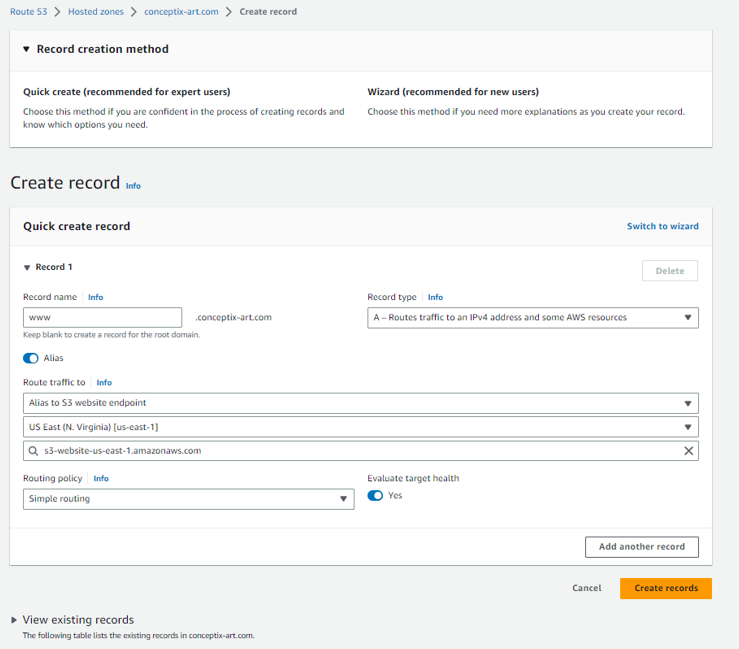

# step 7: Update your Godaddy DNS NS records with the same NS records from your AWS Route 53 hosted zone

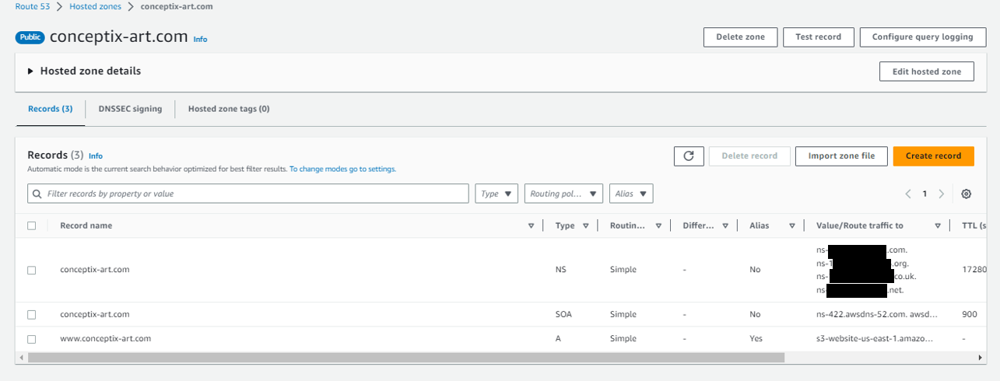


1. Log into your Godaddy's account
2. Go to **Profile name > My Products**
3. Under **Domains**, click *your domain name* and choose **Manage DNS**

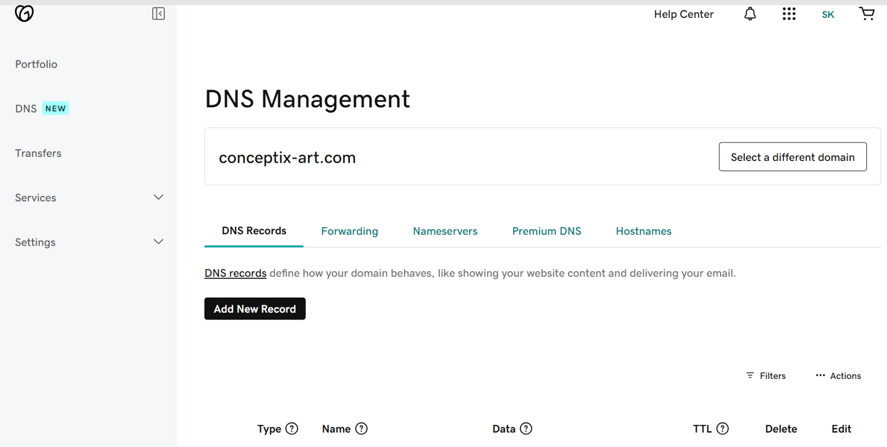

4. Under **Nameservers**, click **Change Nameservers**
5. On the new window, check **I'll use my own nameservers** instead of the Godaddy nameservers
6. Copy and paste your nameservers from AWS and save

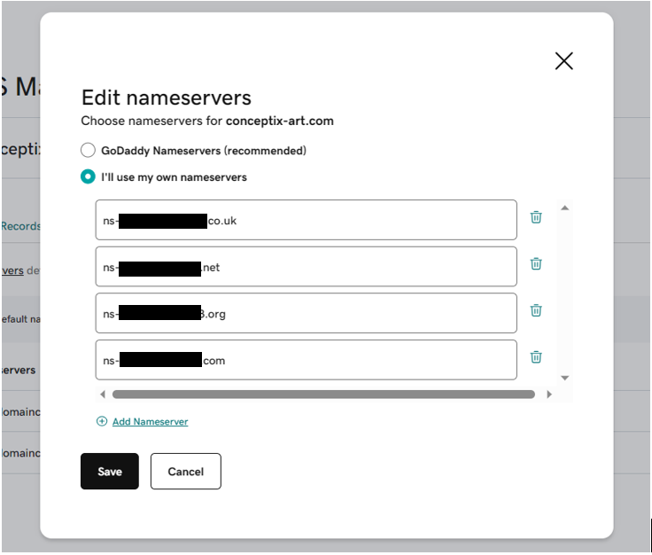

7. Click **Continue** to confirme nameservers update

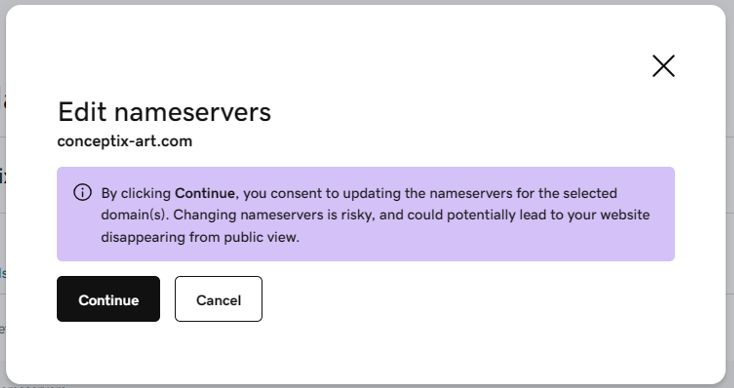


You should now be able to access your static website using your Godaddy domain name www.conceptix-art.com

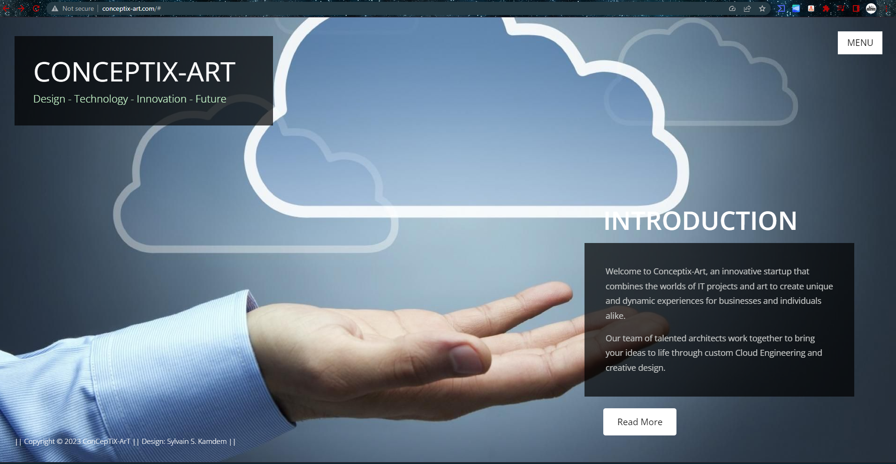


# Step 8: Request TLS certificate in ACM

1. Navigate to the **AWS Certificate Manager** service
2. In the ACM dashboard, click **Request a Certificate** and keep the following settings:
    
    a. **Certificate type** = **Request a public certificate**, then click **Next**

    b. **Fully qualified domain name** = your domain names (*conceptix-art.com, www.conceptix-art.com & *.conceptix-art.com in my case*)

    c. **Validation method** = **DNS validation**

    d. **Key algorithm** = **RSA 2048**

    e. Optionally add a tag
    
    f. Click **Request**

    Click on **View Certificate**. The status of the certificate will be in **pending validation**.
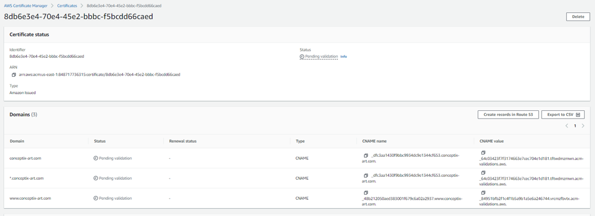

3. In your certificate, click on **Create records in Route 53** to add all your CNAME records to your Route 53 hosted zone, then click on **Create records*.
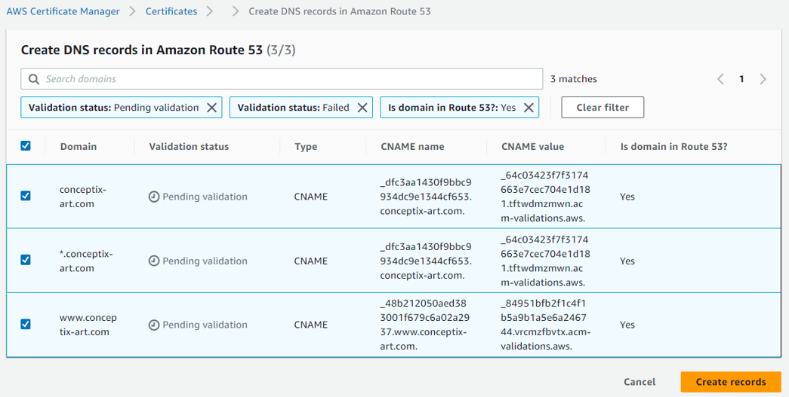

The certificate status will change to **Issued**.

# Step 9: Set up my CloudFront distribution to define how website content will be delivered

1. Navigate to the **CloudFront** service
2. In the Amazon CloudFront dashboard, click **Create a CloudFront distribution** and keep the following settings (for my case, I choosed to use these settings):
    
    a. **Origin domain** = **www.conceptix-art.com.s3-website-us-east-1.amazonaws.com**

    b. **Protocol** = **HTTP Only**

    c. **Enable origin shield** = **No**

    d. **Compress objects automatically** = **Yes**

    e. **Viewers protocol policy** = **Redirect HTTP to HTTPS**
    
    f. **Allowed HTTP methods** = **GET, HEAD**

    g. **Restrict viewers access** = **No**

    h. **Cache key and origin requests** = **Cache policy and origin request policy (recommended)**

    i. **Price class** = **Use North America, Europe, Asia, Middle East, and Africa)

    j. **Alternate domain name (CNAME) - optional** = **conceptix-art.com**

    k. **Custom SSL certificate - optional** = *Select your certificate*; **Security policy** = *TLSv1.2_2021 (recommended)*

    l. **Supported HTTP versions** = **HTTP/2**

    m. **Default root object - optional** = **index.html**

    n. **Standard logging** = **Off**

    o. **IPv6** = **On**

    p. **Web Application Firewall (WAF)** = **Do not enable security protections**.

3. Click **Create distribution**

# Step 10: Create a Route 53 A record as an alias for your CloudFront distribution

1. Click your hosted zone in the Route 53 service dashboard
2. Under the **Records** tab, click **Create record** and provide the following details:
    
    a. Nothing as **Record name**
    
    b. **Record type**: it's **A**
    
    c. **Enable** the option **Alias** 
    
    d. Under **Route traffic to**, set your **Endpoint** type as **Alias to CloudFront distribution**
    
    e. Select your region (it should be already set to your region): **us-east-1** in this case
    
    f. Select your alias value
    
    g. Keep **Routing Policy** to **Simple routing**
    
    h. Click **Create records**

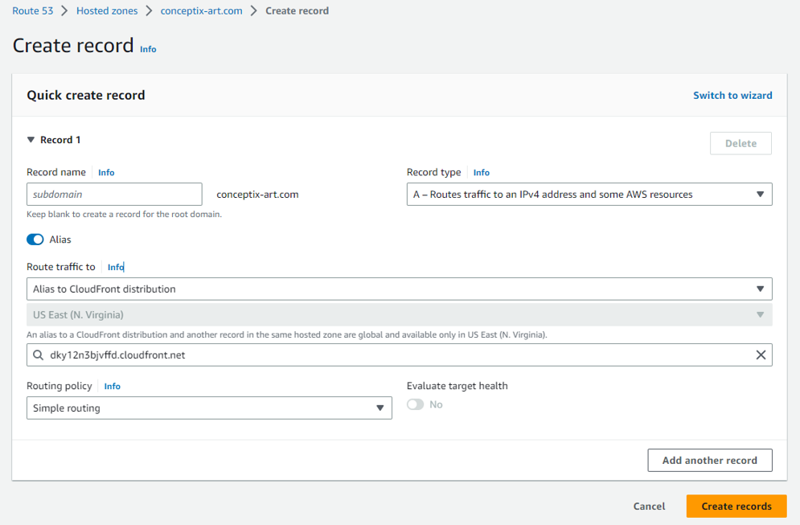

The status of the Route 53 hosted zone will then switch to **INSYNC**, meaning everything is working.

As a result, your secure website is up and running:

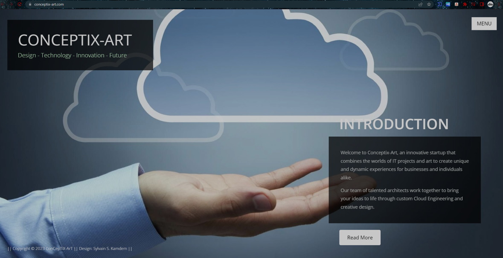


