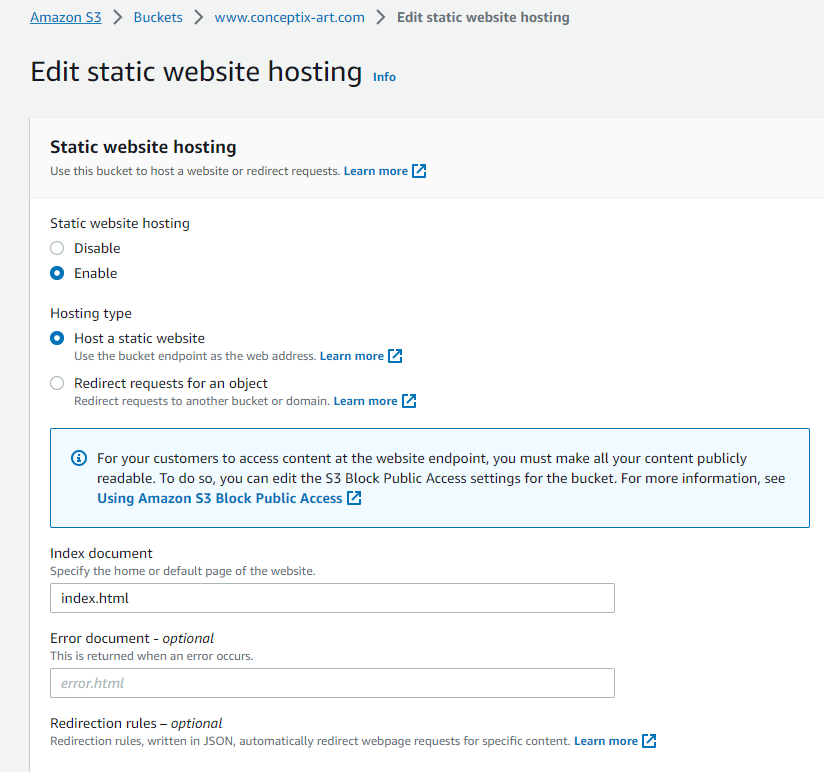
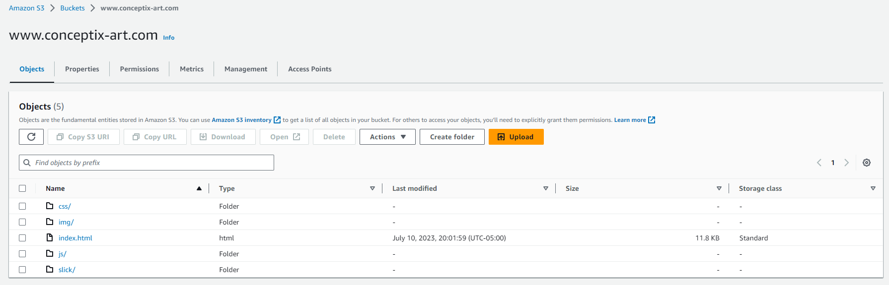

# STEP 1: Create S3 Bucket with your Godaddy domain name (set public access)

1. Log in to the **AWS Management Console**: Go to the AWS Management Console (https://console.aws.amazon.com/) and log in to your AWS account.

2. Navigate to the **S3 service**: Once logged in, you will be in the AWS Management Console dashboard. Search for "S3" in the services search bar or find and click on "S3" under the "Storage" category.

3. Click on **"Create bucket"**: In the S3 dashboard, click on the "Create bucket" button to start creating a new bucket.

4. Enter **bucket details**: In the "Create bucket" dialog, you need to provide the following details:

    a. **Bucket name**: Enter a unique name for your bucket; in this case use your domain name(*www.conceptix-art*).

    b. **Region**: Choose the region where you want to create the bucket; in this case it's *us-east-1*.

    c. Keep the **ACLs disabled** as recommended.

    d. Disable the **Block all public access** option to allow public access to the bucket and **aknowledge** to confirm the public permissions.

    e. **Enable** or keep the bucket versioning **disabled**.

    f. Leave the other options as default and click on **Create bucket**.


# Step 2: Enable static website hosting

1. Click on your bucket
2. Under the **Properties** tab, scroll down to the end of the page and click **Edit** next to **Static Website Hosting**
3. Click on **Enable**
4. Leave the *Hosting type* as **Host a static website**
5. In the *Index document* field, specify your website home file name: Mine is **index.html**
6. If you have one, you can specify your **error document** or your redirection rules (they're optional).



# Step 3: Upload your static website files into your bucket

1. In your bucket, click **Upload**
2. Click **Add folder** and make sure you upload all necessary files and folders to the root of your bucket
3. Click on **Upload**.

Note: You can do this using the AWS CLI by typing commands such as:
```
$ cd local-static-website-folder
$ aws s3 sync . s3://www.conceptix-art.com
```



