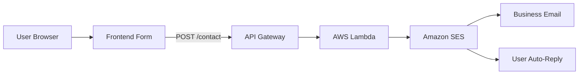

# 🚀 AWS Contact Form Backend

### Conceptix Innovations LLC


---

## 📌 Overview

This project implements a **fully serverless contact form backend** using AWS services.

It enables:

* 📩 Real-time email notifications
* 🤖 Automatic user confirmation emails
* ⚡ Scalable backend with zero servers
* 🔒 No third-party dependencies

---

## 🏗️ Architecture



---

## 🧰 Tech Stack

| Service         | Purpose                |
| --------------- | ---------------------- |
| **Amazon S3**   | Static website hosting |
| **CloudFront**  | CDN & caching          |
| **API Gateway** | HTTP API endpoint      |
| **AWS Lambda**  | Backend logic          |
| **Amazon SES**  | Email delivery         |
| **IAM**         | Permissions            |

---

## ⚙️ How It Works

1. User submits contact form
2. Frontend sends POST request via `fetch()`
3. API Gateway receives request
4. Lambda processes input
5. SES sends:

   * 📧 Business notification
   * 📩 Auto-reply to user
6. Response returned to UI

---

## 📂 Project Structure

```bash
.
├── main.js          # Frontend logic (fetch API)
├── index.html       # Contact form UI
├── styles.css       # Styling
└── README.md        # Documentation
```

---

## 🔐 Environment Variables (DO NOT COMMIT)

Replace with placeholders before pushing to GitHub:

```bash
[YOUR-API-GATEWAY-URL]
[YOUR-BUSINESS-EMAIL]
[YOUR-SES-REGION]
```

---

## 🧠 Lambda Function (Core Logic)

```javascript
import { SESClient, SendEmailCommand } from "@aws-sdk/client-ses";

const ses = new SESClient({ region: "[YOUR-SES-REGION]" });

export const handler = async (event) => {
  try {
    const { name, email, message } = JSON.parse(event.body);

    await ses.send(new SendEmailCommand({
      Source: "[YOUR-BUSINESS-EMAIL]",
      Destination: { ToAddresses: ["[YOUR-BUSINESS-EMAIL]"] },
      Message: {
        Subject: { Data: `New message from ${name}` },
        Body: { Html: { Data: message } }
      }
    }));

    return {
      statusCode: 200,
      headers: cors(),
      body: JSON.stringify({ success: true })
    };

  } catch (err) {
    return {
      statusCode: 500,
      headers: cors(),
      body: JSON.stringify({ error: "Failed" })
    };
  }
};

function cors() {
  return {
    "Access-Control-Allow-Origin": "*",
    "Access-Control-Allow-Headers": "content-type",
    "Access-Control-Allow-Methods": "POST,OPTIONS"
  };
}
```

---

## 🌐 API Endpoint

```
POST https://[API-ID].execute-api.[REGION].amazonaws.com/contact
```

---

## 🧪 Testing

### ✅ Lambda Test

* Use test payload in AWS Console
* Expect: `200 OK`

### ✅ Browser Test

```javascript
fetch("[YOUR-API-GATEWAY-URL]/contact", {
  method: "POST",
  headers: { "Content-Type": "application/json" },
  body: JSON.stringify({
    name: "Test",
    email: "[YOUR-BUSINESS-EMAIL]",
    message: "Hello"
  })
})
.then(res => res.json())
.then(console.log);
```

---

## 🚀 Deployment

### Upload frontend to S3

```bash
aws s3 cp ./main.js s3://[YOUR-BUCKET-NAME]/main.js
```

### Invalidate CloudFront

```bash
aws cloudfront create-invalidation \
  --distribution-id [YOUR-DISTRIBUTION-ID] \
  --paths "/*"
```

---

## 💰 Cost Estimate

| Usage         | Cost         |
| ------------- | ------------ |
| Free Tier     | $0.00        |
| Small traffic | <$0.05/month |
| 10k requests  | ~$0.04       |

---

## 🛠️ Troubleshooting

| Issue           | Fix                  |
| --------------- | -------------------- |
| CORS error      | Redeploy API Gateway |
| 500 error       | Check SES region     |
| Emails in spam  | Verify DKIM          |
| API not working | Check endpoint URL   |

---

## 📦 Commit Example

```bash
feat: add AWS contact form backend (SES + Lambda + API Gateway)
```

---

## ✅ Status

| Phase               | Status     |
| ------------------- | ---------- |
| Static Website      | ✅ Complete |
| Backend Integration | ✅ Complete |

---

## 👨‍💻 Author

**Sylvain Kamdem**
Conceptix Innovations LLC

---

## 📍 Location

Chicagoland, IL

---

## 🔒 License

Internal Use Only — Conceptix Innovations LLC

---

✨ *Technology · Creativity · Excellence*
