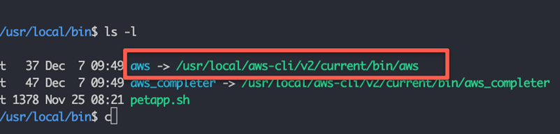
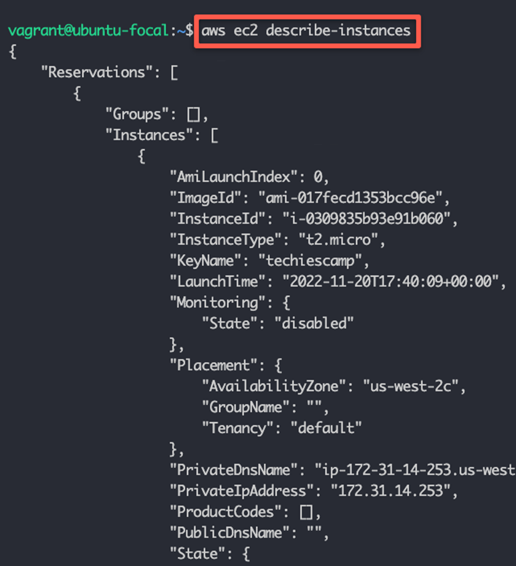
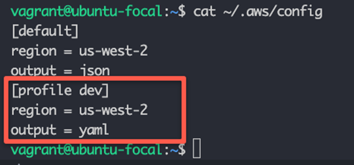
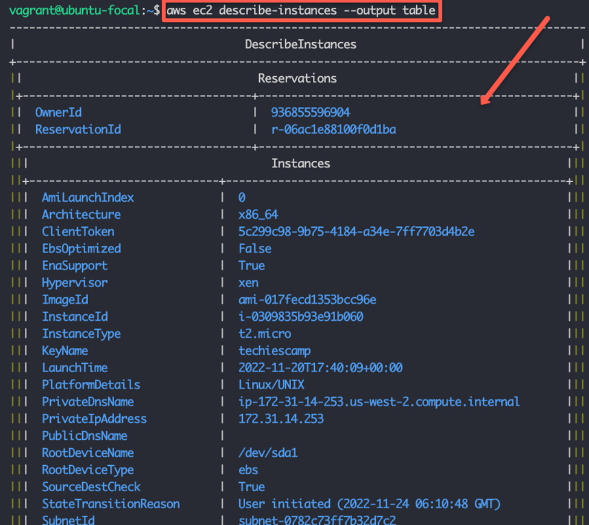

# Installing and Configuring AWS CLI on Linux
## TABLE OF CONTENTS
1.	AWS CLI Prerequisites
2.	Install AWS CLI on Linux
3.	Configure AWS CLI
4.	Configure AWS CLI Using Command
5.	Configure AWS CLI Using Environment Variables
6.	Configure AWS CLI To Access Multiple AWS Accounts Using Named Profiles
7.	Changing AWS CLI Output Format
8.	AWS CLI Important Configurations
9.	AWS CLI Best Practices
10.	AWS CLI Tips


## 1. AWS CLI Prerequisites
The following are the prerequisites to install and configure AWS CLI.
1.	A Valid AWS account.
2.	AWS IAM user access key and secret key with permission to access AWS services. If you don’t have access and secret keys, you can get one created from the AWS IAM service.

## 2. Install AWS CLI on Linux
Step 1: Download the AWC CLI installation files using curl.
```bash
curl "https://awscli.amazonaws.com/awscli-exe-linux-x86_64.zip" -o "awscliv2.zip"
```
Step 2: Unzip the files. Ensure you have unzip utility installed on your system.
```bash
unzip awscliv2.zip
```

Step 3: Install aws-cli using the following command.
```bash
sudo ./aws/install
```

The above command creates a symlink named *aws* in the */usr/local/bin* directory and adds the *AWS CLI executable* to the to */usr/local/aws-cli* location.


Step 4: Verify the installation by checking the AWS CLI version.
```bash
aws --version
```


## 3. Configure AWS CLI
To access AWS services using the CLI, you must configure the CLI with AWS secret and access keys. You can do this using the following two ways:

1.	**Using aws configure command**: Using the CLI command you can configure the AWS keys and default values and persist them in the system under **~/.aws** folder.

2.	**Using CLI Environment variables**: AWS CLI supports many environment variables. If you export the values as environment variables, the AWS CLI will use it to authenticate to the AWS account.

Choosing an option depends upon your use case and personal preference. Let’s take a look at both methods practically.


## 4. Configure AWS CLI Using Command

To configure the CLI, execute the following AWS CLI command.
```
aws configure
```


You will be prompted to provide the **access key, secret key, default region**, and **default output format (json/yaml)**. Provide the required details as shown below.
```
vagrant@de:~$ aws configure
AWS Access Key ID : [****************LBSW]
AWS Secret Access Key: [****************QKwi]
Default region name: us-west-2
Default output format: json
```

After configuration, a folder named **.aws** gets created in the user’s home directory.
```bash
cd $HOME/.aws
```
Inside the **.aws** directory, you will see the following two files:
  1.	**config**: It contains all the default configs like region and output. You can change these values anytime and add new values as default.
  2.	**credentials**: This file contains the access key and secret key as plain text.

The values in the above files can be overridden using the CLI environment variables.

Now that we have configured the CLI, let’s execute an AWC CLI command to describe the instances.
```
aws ec2 describe-instances
```
If you have instances running you will see the instances details in json format as shown below.


Also, you can try creating an ec2 instance using AWS CLI.

## 5. Configure AWS CLI Using Environment Variables

AWS CLI supports many environment variables. The following are the important environment variables.
```
CLI Environment Variable	Value
AWS_ACCESS_KEY_ID	AWS     Access key
AWS_SECRET_ACCESS_KEY	    AWS Secret key
AWS_DEFAULT_REGION	        Default AWS region. Example, us-west-2
AWS_DEFAULT_OUTPUT	        Supported AWS CLI output formats. [json, yaml, yaml-stream, text & table]
```
You can set the environment variable using the export command as shown below. Replace the highlighted values with your own.
```
export AWS_ACCESS_KEY_ID=SDFGEWRTWERSDFGSDFG
export AWS_SECRET_ACCESS_KEY=sdfKJHkjbhkjkKJSDFKJHkjhjkhjkhKKJH
export AWS_DEFAULT_REGION=us-west-2
export AWS_DEFAULT_OUTPUT=json
```
To know the available environment variables, check the official CLI documentation > https://docs.aws.amazon.com/cli/latest/topic/config-vars.html.

To verify the export, execute the describe instance command.
```
aws ec2 describe-instances
```
    Important Note: If you export CLI environement variables, it will be available only during thar user shell session. If you logout you need to export the variables again for it to be available for the CLI. Also, AWS CLI environemnt variables overrides the default config present in the *$HOME/.aws* location.

## 6. Configure AWS CLI To Access Multiple AWS Accounts Using Named Profiles
There are use cases where you need to connect to multiple AWS accounts from a single workstation. For example, dev, stage, and prod accounts. For this, you can make use of **AWS CLI named profiles**.

You can create a new profile using the following command. Where **dev** is the profile name. You can create more profiles with different names.
```
aws configure --profile dev
```
Once you configure the profile, you can see the default profile values in the **$HOME/.aws/config** file as shown below.


Also, the credentials of the profile get stored in the **$HOME/.aws/credentials** file under **[dev]** profile.

    Note: You can also manually enter profile information in the config and credentials files

To select or switch between different named profiles, export the **AWS_PROFILE** environment variable with the profile name as shown below.
```
export AWS_PROFILE=dev
```

Alternatively, you can pass the profile name in individual CLI commands as shown below.
```
aws ec2 describe-instances --profile dev
```

## 7. Changing AWS CLI Output Format
To change the CLI output format, you can edit the config file or run the **aws configure** command to update the new output format.

Alternatively, you can use the **--output** flag with the aws CLI command to override the default output format.

For example, to list ec2 instances in the **table output format**, you can use the following command with the **--output** flag.
```
aws ec2 describe-instances --output table
```
Here is the table output format.


Similarly, you can use other formats like json and yaml with the –output flag.

## 8. AWS CLI Important Configurations
The following table has all the important AWS CLI configurations and their locations.
```
AWS CLI Configuration	             Details
Default config location.	         $HOME/.aws/config
Default credential location.	   $HOME/.aws/credentials
Environment variable to change the AWS CLI profile	 
  AWS_PROFILE
```


## 9. AWS CLI Best Practices

Following are some of the best practices when using AWS CLI.
1.	Always secure your AWS credentials by following AWS security best practices https://devopscube.com/things-to-do-for-securing-aws-account/. **Ensure you are not updating the access and secret keys in code files**.
2.	Use named profiles to connect to different AWS accounts.
3.	When using named profiles, always verify the environment you are running the CLI command. You might end up accidentally deleting or updating production services.
4.	If you want to use AWS CLI on ec2 instances, always use IAM roles instead of access and secret keys.


## 10. AWS CLI Tips
By default, the CLI output goes to less in Linux. If you want to see the whole output in the command line, export **AWS_PAGER** environment variable to an empty string as shown below.
```
export AWS_PAGER=""
```
You can also set this configuration in the config file as shown below.
```
[default]
region = us-west-2
output = json
aws_page=""
```

