## Prerequisites

* a Windows computer handy 
* an AWS account (free tier)

## Downloading AWS CLI to Install on Windows (MSI Installer)

Even though AWS CLI works on different operating systems, like Windows, MacOS, and Linux, AWS CLI does not come installed by default. The easiest way to install AWS CLI on Windows is via the MSI installer, so you do not have to worry about manually configuring anything.
To download the AWS CLI MSI installer:
1. Open your favorite web browser, and visit the AWS CLI page on the Amazon website https://aws.amazon.com/cli/.

2. Navigate to the section labeled **Window** (right panel), and click the *64-bit hyperlink* under Windows to download the latest MSI installer for AWS CLI.

3. Once downloaded, double-click on the MSI installer file to launch the AWS CLI installation wizard (step four).

4. Click **Next** on the welcome screen of the installer wizard to continue with the installation.

5. Now, review the license agreement terms, tick the **I accept the terms** in the license agreement checkbox, and click **Next** to accept the agreement.

6. On the next page, either keep the default install location of AWS CLI, or click on Browse to choose a different one, and click **Next**.

7. Click **Install** to start the installation process.

8. Once installed, click **Finish** to exit the installation wizard.

9. Finally, open *PowerShell as administrator* and run the following command to verify the installation was successful.

```
aws --version
```

This command returns the current version of AWS CLI installed on your computer.

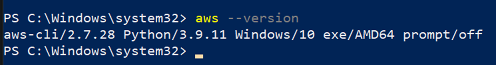

## Creating an IAM User

To create an IAM user, follow these steps:
1. Sign in to your AWS Management Console https://aws.amazon.com/console/ on your web browser as your root user.

2. Next, search for **IAM** in the console’s search bar (top-most), and select the **IAM** service from the list of results to access the IAM console.

3. In the IAM console, click on **Users** in the left sidebar and then click on **Add user**. This action opens the Add user page.

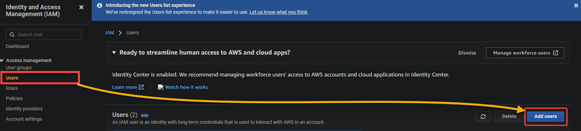

4. Now, set the user details with the following:
    * Set a *User name* for your IAM user.
    * Select the *Access key* – *Programmatic access* option for the AWS access type. This option gives your IAM user access to the AWS API, which you need for using AWS CLI.
    * Click **Next**: Permissions to continue.

    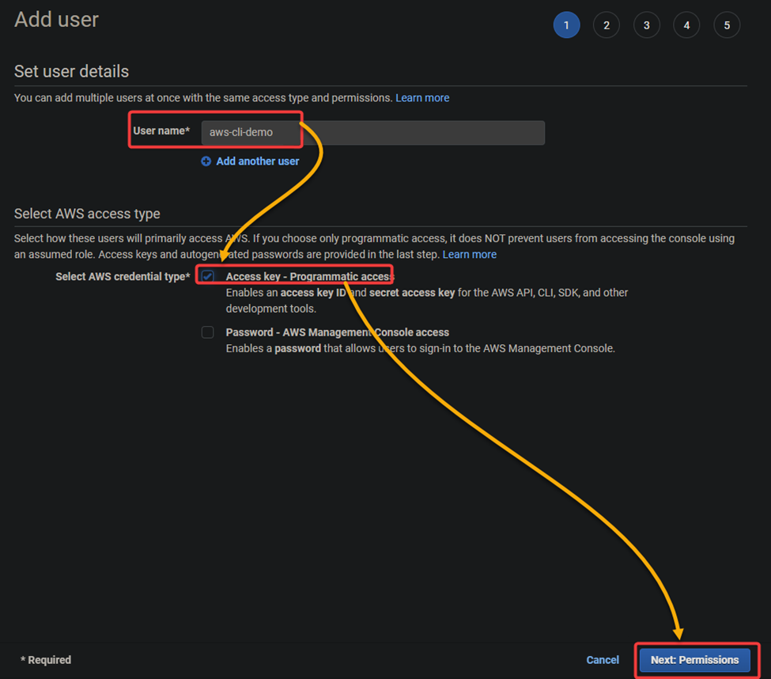

5. Set permissions for your IAM user, and you can set permissions in two ways:
    * The first way is to create a new IAM policy and attach it to your IAM user.
    * The second way is to add an existing IAM policy with the necessary permissions.
But here, we will set permissions using the 2nd approach:
        * Select the **Add existing policies** directly option.
        * In the *Filter field*, type **AmazonS3FullAccess** and tick the checkbox next to that policy. This action adds the *AmazonS3FullAccess* policy to your IAM user, giving the user full access to all Amazon S3 resources.
        * Click **Next**: Tags to continue.

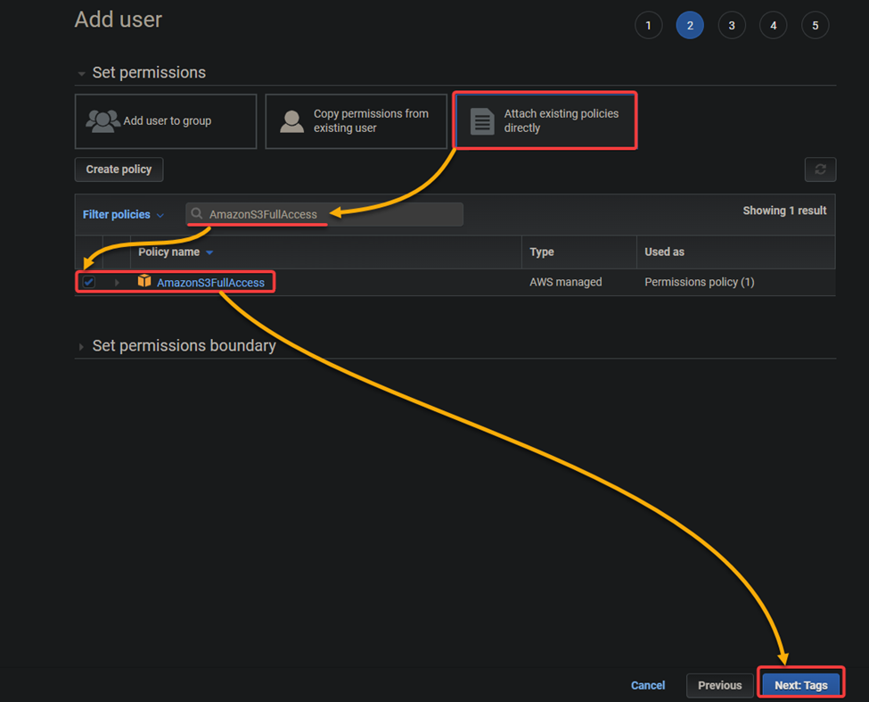
 
6. Next, add tags as you like, and click **Next**: Review (bottom-right). *Tags are key-value pairs that you can use to categorize your resources*.
But her we don’t need to add any tags.

7. Finally, review the information about your IAM user and then click **Create user** to create the IAM user.

Once the user has been created, you will see a confirmation message with the user’s access and secret access keys. 
**Make sure to copy these keys or download the CSV file because you will need them later in configuring your AWS profile.**

**Never share your secret access key with anyone. Someone who obtains your secret access key will have full access to your AWS account.**
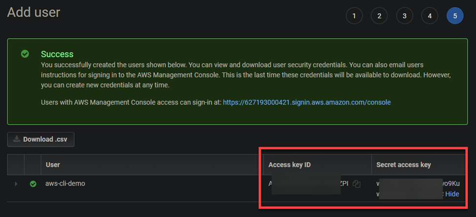

## Configuring the AWS Profile

You now have an IAM user ready to use in your AWS CLI. But first, you need to configure your AWS profile to interact with your AWS resources. Your AWS profile is a set of credentials you can use to authenticate yourself using the AWS CLI.

Run the following aws configure command on PowerShell to start configuring your AWS profile. This command prompts you to enter **your access key**, **secret access key**, **default region**, and **output format**.
```
aws configure
```

When prompted, configure your AWS profile with the following:
* **AWS Access Key ID** and **AWS Secret Access Key** – Enter your access and secret keys you noted in the last step of the “Creating an IAM User” section.
* **Default region name** – Enter the AWS Region where you want to run your commands. For example, you can enter “us-east-1”.
•	**Default output format** – Enter **“json**,” the default output format for the AWS CLI, which is easier to parse programmatically.
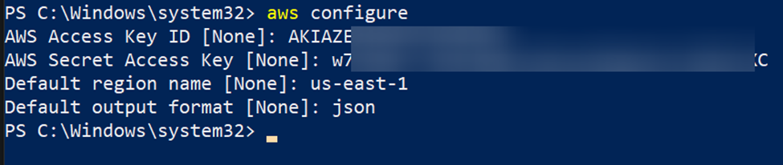


Your AWS profile should be configured at this point, and all the AWS CLI commands you run will use these credentials by default.

Now, run the **cat** command below to view the contents of the *~/.aws/credentials* file where your credentials are saved. The AWS CLI reads this file to determine your credentials when you run a command.
```bash
cat ~/.aws/credentials
```
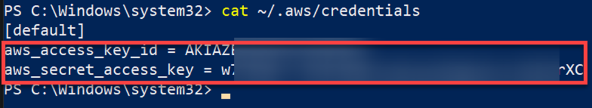

## Creating an S3 Bucket and Uploading Files

If you’ve been using the AWS console, you can think of the AWS CLI as an alternative way to manage your AWS resources. The AWS CLI unlocks even more possibilities, such as scripting and automating tasks.
To create an Amazon S3 bucket using the AWS CLI:

1. Run the following aws s3 mb command to create a bucket named *aws-cli-s3-demo02456412*. Ensure you replace *aws-cli-s3-demo02456412* with a **unique name** for your bucket.
**Note that the bucket’s name must be unique across all Amazon S3.**
```
aws s3 mb s3://aws-cli-s3-demo02456412
```
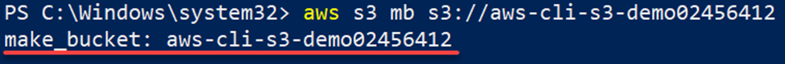

2. Next, run the below **aws s3 ls** command to list the buckets available in your AWS account.
```
aws s3 ls
```
The output below confirms the newly-created S3 bucket exists.

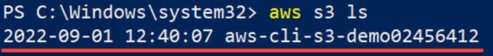

3. Run the **aws s3 cp** command below to upload a file called *text01.txt* from your local machine to your new Amazon S3 bucket (*s3://aws-cli-s3-demo02456412/*).
Replace *C:\textfiles\text01.txt* with your file’s name and location.
```
aws s3 cp C:\textfiles\text01.txt s3://aws-cli-s3-demo02456412/
```
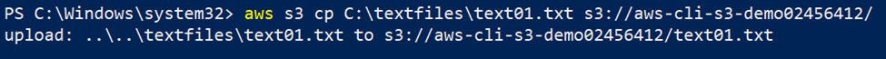

4. Finally, navigate to your Amazon S3 console to verify that the file has been uploaded.
You should now see the file in your Amazon S3 bucket, as shown below. This output confirms the AWS CLI in your Windows machine works correctly.
 
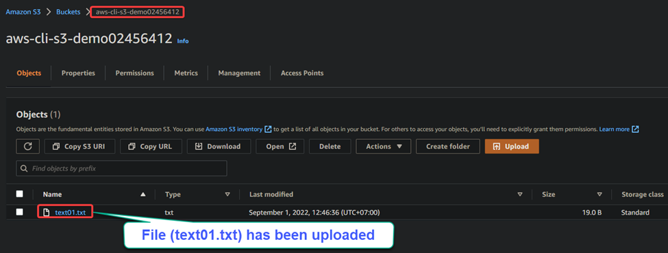
