# AWS CloudFormation — EC2 Stack Lab
*Project Documentation*

| | |
|---|---|
| **Student Name** | Sylvain Simo |
| **Course** | UCT DevOps Bootcamp |
| **Instructor** | Valery Nyandja |
| **Assignment** | AWS CloudFormation — EC2 Stack Lab |
| **AWS Region** | us-east-1 (N. Virginia) |
| **Date Submitted** | June 24, 2026 |

*Conceptix Innovations LLC | Oak Lawn, IL*

---

## Table of Contents

1. [Project Overview](#1-project-overview)
2. [How to Deploy a CloudFormation Stack](#2-how-to-deploy-a-cloudformation-stack)
3. [Template 1 — EC2 Linux + SSH](#3-template-1--ec2-linux--ssh)
4. [Template 2 — EC2 Windows + RDP](#4-template-2--ec2-windows--rdp)
5. [Template 3 — Linux Apache Web Server](#5-template-3--linux-apache-web-server)
6. [Template 4 — Windows IIS Web Server](#6-template-4--windows-iis-web-server)
7. [AWS Resource Summary](#7-aws-resource-summary)
8. [Key CloudFormation Concepts Used](#8-key-cloudformation-concepts-used)
9. [Lessons Learned](#9-lessons-learned)
10. [Conclusion](#10-conclusion)

---

## 1. Project Overview

This document records the deployment and validation of four AWS CloudFormation stacks as part of the EC2 Stack Lab assignment. The goal of the lab is to practice Infrastructure as Code (IaC) by deploying pre-written JSON templates through the AWS Management Console instead of manually configuring resources by hand.

Each template provisions an EC2 instance with specific configuration, and every stack must be validated by either connecting to the instance directly or loading the website URL produced in the stack Outputs.

### 1.1 What is CloudFormation?

AWS CloudFormation is a service that lets you define AWS infrastructure in a text file (JSON or YAML). Instead of clicking through the console every time, you write a template once and CloudFormation creates, updates, or deletes all the described resources as a single unit called a stack. This makes deployments faster, repeatable, and version-controlled.

### 1.2 Lab Stacks at a Glance

| # | Description | Key Parameter | Validation Method |
|---|---|---|---|
| 1 | EC2 Linux + SSH | `KeyName` (key pair) | SSH into instance |
| 2 | EC2 Windows + RDP | `KeyName` (key pair) | RDP into instance |
| 3 | Linux Apache web server | UserData script | Open `WebsiteURL` in browser |
| 4 | Windows IIS web server | UserData script | Open `WebsiteURL` in browser |

### 1.3 Prerequisites

- AWS account with access to EC2 and CloudFormation in `us-east-1`
- An existing EC2 key pair saved as a `.pem` file (needed for Templates 1 and 2)
- The four JSON template files
- SSH client (PuTTY)
- Remote Desktop client for connecting to Windows instances

---

## 2. How to Deploy a CloudFormation Stack

The process below applies to all four templates. Each template section in this document references these same steps and notes what is different for that specific stack.

1. **Open CloudFormation in the AWS Console** — Go to **Services > CloudFormation** (or search "CloudFormation" in the top search bar). Make sure the region selector in the top-right shows `us-east-1`.
2. **Click Create Stack > With new resources (standard)** — This opens the stack creation wizard.
3. **Upload the template file** — Under *Specify template*, select **Upload a template file**. Click **Choose file** and select the correct `.json` template for this stack. Click **Next**.
4. **Name the stack and fill in parameters** — Enter a Stack name following the naming convention. Fill in any required parameters (e.g. `KeyName`). Click **Next**.
5. **Accept defaults on Configure stack options** — Leave all options at their defaults unless instructed otherwise. Click **Next**.
6. **Review and Submit** — Review the summary. Click **Submit**. CloudFormation begins creating the stack — status shows `CREATE_IN_PROGRESS`.
7. **Wait for CREATE_COMPLETE** — Refresh the Events tab until the status shows `CREATE_COMPLETE`. This typically takes 1–3 minutes for Linux stacks and 3–8 minutes for Windows stacks.
8. **Validate the stack** — Go to the Outputs tab for the stack URL, or go to EC2 to find the instance IP and connect.

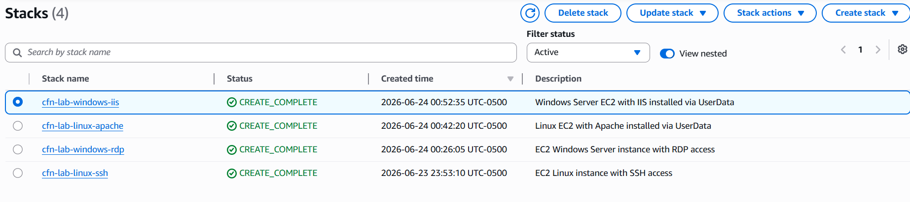

---

## 3. Template 1 — EC2 Linux + SSH

**EC2 Linux Instance with SSH Access (Port 22)**

This template provisions a basic Amazon Linux EC2 instance and opens port 22 (SSH) in the security group. The goal is to prove the instance is reachable by connecting to it over SSH using the key pair provided as a parameter.

### 3.1 Template JSON

The following JSON template was provided for this stack. It defines one EC2 instance, one security group allowing SSH from anywhere, and outputs the instance's public IP address.

```json
{
  "AWSTemplateFormatVersion": "2010-09-09",
  "Description": "EC2 Linux instance with SSH access",
  "Parameters": {
    "KeyName": {
      "Type": "AWS::EC2::KeyPair::KeyName",
      "Description": "Name of an existing EC2 key pair"
    }
  },
  "Resources": {
    "LinuxSG": {
      "Type": "AWS::EC2::SecurityGroup",
      "Properties": {
        "GroupDescription": "Allow SSH",
        "SecurityGroupIngress": [{
          "IpProtocol": "tcp", "FromPort": 22, "ToPort": 22,
          "CidrIp": "0.0.0.0/0"
        }]
      }
    },
    "LinuxInstance": {
      "Type": "AWS::EC2::Instance",
      "Properties": {
        "InstanceType": "t3.micro",
        "ImageId": "ami-0c02fb55956c7d316",
        "KeyName": { "Ref": "KeyName" },
        "SecurityGroups": [{ "Ref": "LinuxSG" }]
      }
    }
  },
  "Outputs": {
    "InstancePublicIP": {
      "Value": { "Fn::GetAtt": ["LinuxInstance", "PublicIp"] },
      "Description": "Public IP of the Linux instance"
    }
  }
}
```

### 3.2 Stack Deployment

| | |
|---|---|
| **Stack Name** | `cfn-lab-linux-ssh` |
| **Template File** | `template1-linux-ssh.json` |
| **Parameter** | `KeyName` |
| **Instance Type** | t3.micro |
| **AMI** | Amazon Linux 2 (`ami-0c02fb55956c7d316` or latest) |
| **Security Group** | Port 22 (SSH) open — `0.0.0.0/0` |

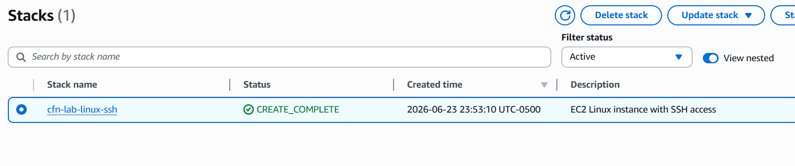
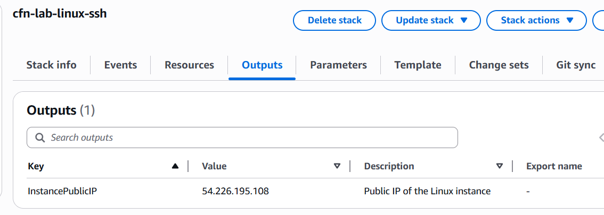

### 3.3 Validation — Connect via SSH

Retrieved the public IP from the Outputs tab, then connected from a local terminal:

```bash
sudo cp KeyName.pem ~/KeyName.pem
chmod 400 ~/KeyName.pem
ssh -i ~/KeyName.pem ec2-user@54.226.195.108
```

Once connected, confirmed the instance details:

```bash
hostname
cat /etc/os-release
```

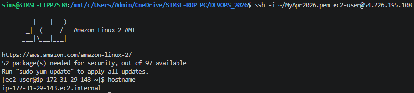

> 📝 **Note:** Port 22 is open to `0.0.0.0/0` in this lab template for simplicity. In production, always restrict SSH to your own IP (*My IP*) to reduce the attack surface.

---

## 4. Template 2 — EC2 Windows + RDP

**EC2 Windows Server Instance with RDP Access (Port 3389)**

This template provisions a Windows Server EC2 instance and opens port 3389 (RDP) in the security group. Validation requires retrieving the Windows Administrator password using the key pair and then connecting via Remote Desktop.

### 4.1 Template JSON

```json
{
  "AWSTemplateFormatVersion": "2010-09-09",
  "Description": "EC2 Windows Server instance with RDP access",
  "Parameters": {
    "KeyName": {
      "Type": "AWS::EC2::KeyPair::KeyName",
      "Description": "Name of an existing EC2 key pair"
    }
  },
  "Resources": {
    "WindowsSG": {
      "Type": "AWS::EC2::SecurityGroup",
      "Properties": {
        "GroupDescription": "Allow RDP",
        "SecurityGroupIngress": [{
          "IpProtocol": "tcp", "FromPort": 3389, "ToPort": 3389,
          "CidrIp": "0.0.0.0/0"
        }]
      }
    },
    "WindowsInstance": {
      "Type": "AWS::EC2::Instance",
      "Properties": {
        "InstanceType": "t3.small",
        "ImageId": "ami-09639480113b0df96",
        "KeyName": { "Ref": "KeyName" },
        "SecurityGroups": [{ "Ref": "WindowsSG" }]
      }
    }
  },
  "Outputs": {
    "InstancePublicIP": {
      "Value": { "Fn::GetAtt": ["WindowsInstance", "PublicIp"] },
      "Description": "Public IP of the Windows instance"
    }
  }
}
```

### 4.2 Stack Deployment

| | |
|---|---|
| **Stack Name** | `cfn-lab-windows-rdp` |
| **Template File** | `template2-windows-rdp.json` |
| **Parameter** | `KeyName` |
| **Instance Type** | t3.small |
| **AMI** | Windows Server 2025 Base |
| **Security Group** | Port 3389 (RDP) open — `0.0.0.0/0` |

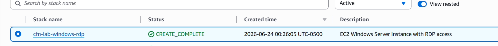
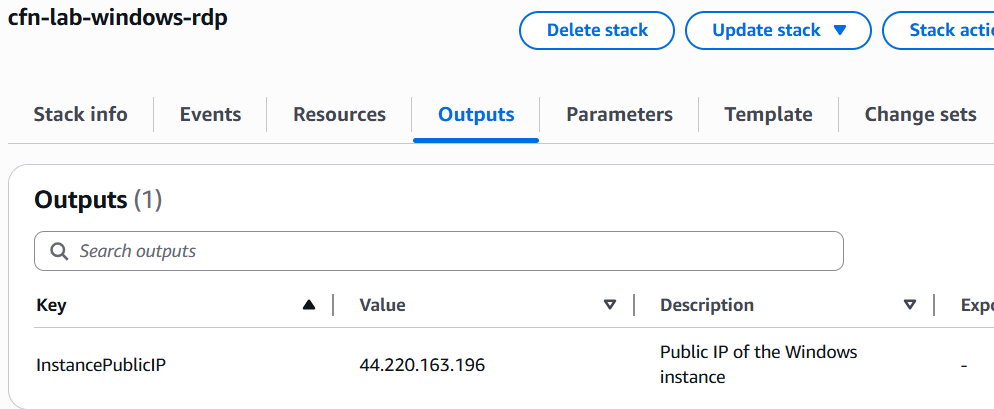

### 4.3 Validation — Connect via RDP

After the stack reached `CREATE_COMPLETE` status:

- Navigated to **EC2 > Instances** and located the Windows instance
- Clicked **Actions > Security > Get Windows Password**
- Uploaded the `.pem` key file and clicked **Decrypt Password** — saved the password
- In EC2, clicked **Connect > RDP Client > Download remote desktop file**
- Opened the `.rdp` file, entered Username: `Administrator` and the decrypted password

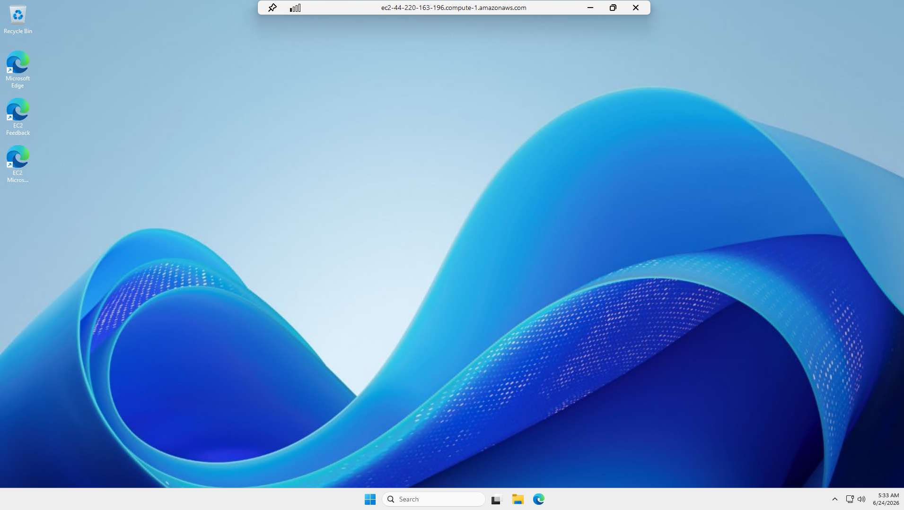

> 📝 **Note:** Windows instances take 3–5 minutes after reaching running state before the password is available. If the *Decrypt Password* button is greyed out, wait a few more minutes and try again.

---

## 5. Template 3 — Linux Apache Web Server

**Linux EC2 with Apache — Automated via UserData Script**

This template provisions an Amazon Linux EC2 instance and uses a CloudFormation UserData script to automatically install and start Apache at boot. The template outputs a `WebsiteURL` that should serve a working web page — no manual SSH required to validate.

### 5.1 What is UserData?

UserData is a CloudFormation (and EC2) feature that lets you pass a shell script to an instance. The script runs automatically the first time the instance boots. This is how the template installs Apache without any manual steps — it is all handled by the script inside the template.

### 5.2 Template JSON

```json
{
  "AWSTemplateFormatVersion": "2010-09-09",
  "Description": "Linux EC2 with Apache installed via UserData",
  "Resources": {
    "WebSG": {
      "Type": "AWS::EC2::SecurityGroup",
      "Properties": {
        "GroupDescription": "Allow HTTP",
        "SecurityGroupIngress": [{
          "IpProtocol": "tcp", "FromPort": 80, "ToPort": 80,
          "CidrIp": "0.0.0.0/0"
        }]
      }
    },
    "WebServer": {
      "Type": "AWS::EC2::Instance",
      "Properties": {
        "InstanceType": "t3.micro",
        "ImageId": "ami-0c02fb55956c7d316",
        "SecurityGroups": [{ "Ref": "WebSG" }],
        "UserData": {
          "Fn::Base64": {
            "Fn::Join": ["", [
              "#!/bin/bash\n",
              "yum update -y\n",
              "yum install -y httpd\n",
              "systemctl start httpd\n",
              "systemctl enable httpd\n",
              "echo '<h1>UCT CloudFormation Apache Lab by SIMS</h1>' > /var/www/html/index.html\n"
            ]]
          }
        }
      }
    }
  },
  "Outputs": {
    "WebsiteURL": {
      "Value": { "Fn::Join": ["", ["http://", { "Fn::GetAtt": ["WebServer", "PublicDnsName"] }]] },
      "Description": "URL of the Apache web server"
    }
  }
}
```

### 5.3 Stack Deployment

| | |
|---|---|
| **Stack Name** | `cfn-lab-linux-apache` |
| **Template File** | `template3-linux-apache.json` |
| **Parameters** | None — no parameters required for this template |
| **Instance Type** | t3.micro |
| **Security Group** | Port 80 (HTTP) open — `0.0.0.0/0` |
| **UserData action** | Installs `httpd`, starts and enables the service, writes `index.html` |

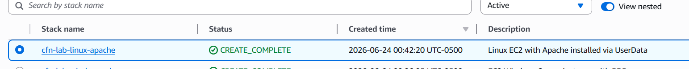
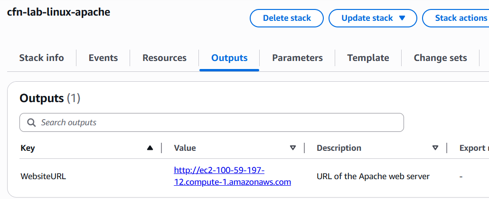

### 5.4 Validation — Open WebsiteURL in Browser

Clicked the `WebsiteURL` link in the Outputs tab. The page loaded successfully, confirming that Apache was installed and running by the UserData script.

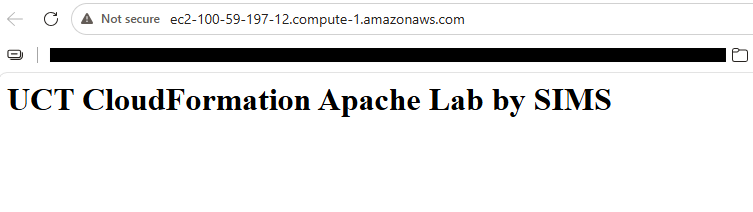

> 📝 **Note:** If the page does not load immediately after the stack shows `CREATE_COMPLETE`, wait 1–2 minutes. UserData scripts run after the instance has booted, so there can be a small delay before Apache is ready to serve traffic.

---

## 6. Template 4 — Windows IIS Web Server

**Windows Server EC2 with IIS — Automated via UserData Script**

This template provisions a Windows Server EC2 instance and uses a PowerShell-based UserData script to automatically install IIS (Internet Information Services) at boot. Like Template 3, it outputs a `WebsiteURL` and requires no manual RDP connection to validate.

### 6.1 UserData on Windows

On Windows, the UserData script is a PowerShell script wrapped in `<powershell>` tags. CloudFormation (via the EC2Config or EC2Launch agent) runs this script on first boot. The script installs IIS and creates a simple welcome page automatically.

### 6.2 Template JSON

```json
{
  "AWSTemplateFormatVersion": "2010-09-09",
  "Description": "Windows Server EC2 with IIS installed via UserData",
  "Resources": {
    "WinWebSG": {
      "Type": "AWS::EC2::SecurityGroup",
      "Properties": {
        "GroupDescription": "Allow HTTP",
        "SecurityGroupIngress": [{
          "IpProtocol": "tcp", "FromPort": 80, "ToPort": 80,
          "CidrIp": "0.0.0.0/0"
        }]
      }
    },
    "WinWebServer": {
      "Type": "AWS::EC2::Instance",
      "Properties": {
        "InstanceType": "t3.small",
        "ImageId": "ami-09639480113b0df96",
        "SecurityGroups": [{ "Ref": "WinWebSG" }],
        "UserData": {
          "Fn::Base64": "<powershell>\nInstall-WindowsFeature -Name Web-Server -IncludeManagementTools\n$html = '<h1>UCT CloudFormation IIS Lab by SIMS</h1>'\nSet-Content -Path C:\\inetpub\\wwwroot\\iisstart.htm -Value $html\n</powershell>"
        }
      }
    }
  },
  "Outputs": {
    "WebsiteURL": {
      "Value": { "Fn::Join": ["", ["http://", { "Fn::GetAtt": ["WinWebServer", "PublicDnsName"] }]] },
      "Description": "URL of the IIS web server"
    }
  }
}
```

### 6.3 Stack Deployment

| | |
|---|---|
| **Stack Name** | `cfn-lab-windows-iis` |
| **Template File** | `template4-windows-iis.json` |
| **Parameters** | None — no parameters required for this template |
| **Instance Type** | t3.small |
| **Security Group** | Port 80 (HTTP) open — `0.0.0.0/0` |
| **UserData action** | Installs IIS (`Web-Server` feature), writes custom `iisstart.htm` page |

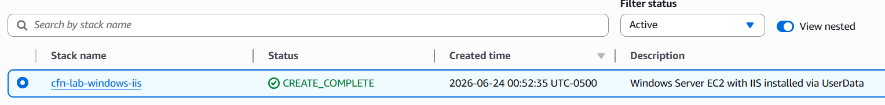
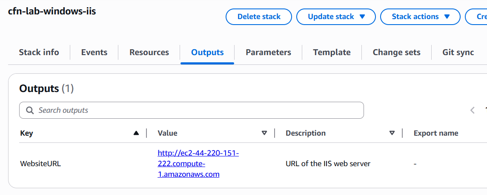

### 6.4 Validation — Open WebsiteURL in Browser

Clicked the `WebsiteURL` link in the Outputs tab. The IIS welcome page loaded successfully, confirming that IIS was installed and the custom page was written by the UserData PowerShell script.

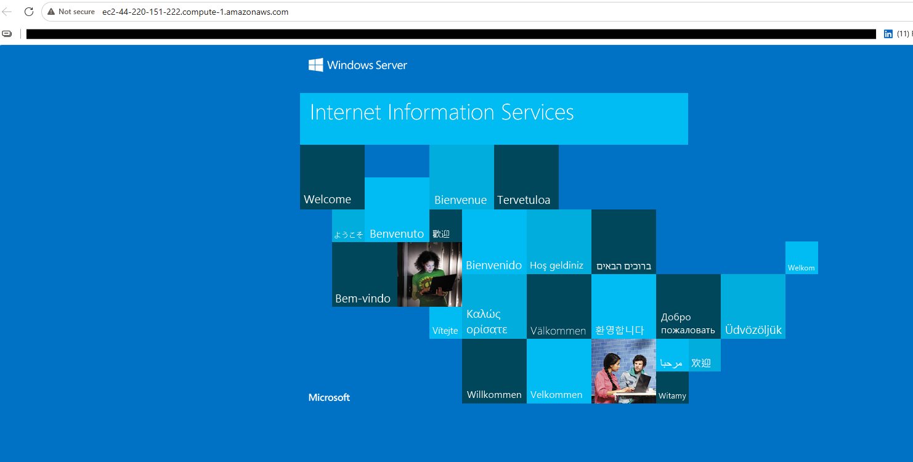
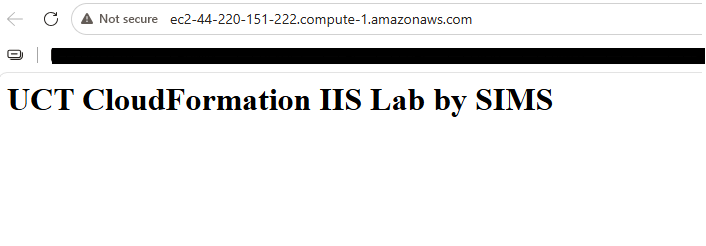

> 📝 **Note:** Windows UserData scripts take longer than Linux — IIS installation can take 5–10 minutes after the instance reaches running state. If the page times out, wait a few minutes and refresh.

---

## 7. AWS Resource Summary

The table below lists every CloudFormation stack and key resource created during this lab. All resources are in the `us-east-1` region.

| Stack Name | Template | Resources Created | Validation |
|---|---|---|---|
| `cfn-lab-linux-ssh` | Template 1 | EC2 (Linux), Security Group (SSH 22) | SSH to public IP |
| `cfn-lab-windows-rdp` | Template 2 | EC2 (Windows), Security Group (RDP 3389) | RDP to public IP |
| `cfn-lab-linux-apache` | Template 3 | EC2 (Linux), Security Group (HTTP 80) | WebsiteURL in browser |
| `cfn-lab-windows-iis` | Template 4 | EC2 (Windows), Security Group (HTTP 80) | WebsiteURL in browser |

---

## 8. Key CloudFormation Concepts Used

| Concept | What It Does in This Lab |
|---|---|
| **Parameters** | Allow the user to pass values into the template at deploy time (e.g. `KeyName`). Makes templates reusable without editing the JSON. |
| **Resources** | The core section of every template. Defines which AWS resources to create — EC2 instances, security groups, etc. |
| **UserData** | A script embedded in the template that runs automatically on first boot. Used here to install Apache (Linux) and IIS (Windows) without manual steps. |
| **Fn::Base64** | A CloudFormation function that Base64-encodes the UserData script, which is required by EC2. |
| **Fn::GetAtt** | A CloudFormation function that retrieves an attribute of a resource — e.g. the `PublicIp` or `PublicDnsName` of an EC2 instance. |
| **Fn::Join** | Concatenates strings — used here to build the full `WebsiteURL` by joining `http://` with the instance's public DNS name. |
| **Outputs** | Values that CloudFormation exposes after a stack is created — such as a public IP or website URL — visible in the Outputs tab of the console. |
| **Ref** | References another resource or parameter in the same template — e.g. attaching a security group to an instance using its logical name. |

---

## 9. Lessons Learned

- **CloudFormation makes infrastructure repeatable.** The same template can be deployed multiple times in any region or account and will always produce the same result, unlike manual console setup which is error-prone and hard to track.
- **UserData is powerful for automation.** Installing and configuring software at launch — without SSHing or RDPing into the instance — demonstrates how real production deployments work at scale.
- **Stack Outputs are the handoff mechanism.** Rather than hunting through EC2 for IPs and DNS names, the Outputs tab surfaces exactly what you need to validate the deployment, and can be consumed by other stacks or automation pipelines.
- **Windows instances take longer.** Windows stacks consistently took longer than Linux stacks to reach `CREATE_COMPLETE` and then an additional wait for UserData to finish. Planning for this delay is important when building Windows-based pipelines.
- **Templates are version-controllable code.** Storing these JSON files in Git means infrastructure changes can be reviewed, rolled back, and audited just like application code — the core benefit of the IaC approach.

---

## 10. Conclusion

All four CloudFormation stacks were successfully deployed and validated. Templates 1 and 2 demonstrated deploying Linux and Windows EC2 instances with direct connectivity (SSH and RDP), while Templates 3 and 4 demonstrated the power of UserData automation to configure a fully working web server at launch without any manual steps.

This lab established the foundation for all future IaC work: writing infrastructure as code, deploying it in a controlled and repeatable way, and validating results through defined outputs rather than manual inspection. These patterns — parameterized templates, UserData automation, and stack outputs — are the same building blocks used in production AWS environments.

---

**Sylvain Simo Kamdem**
*June 24, 2026*
