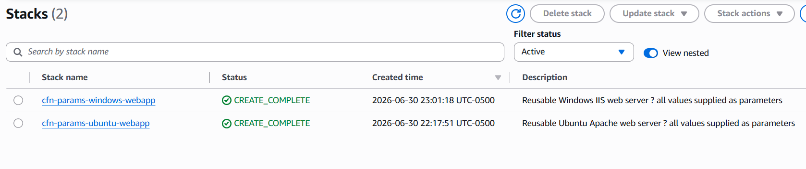
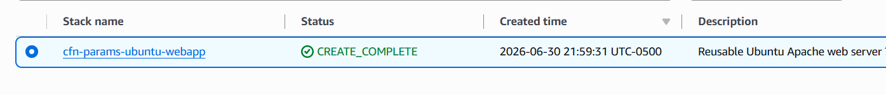
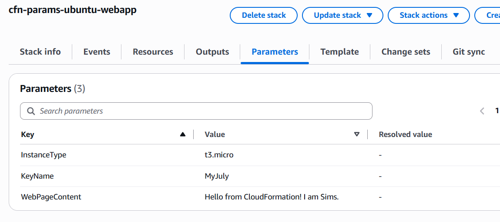
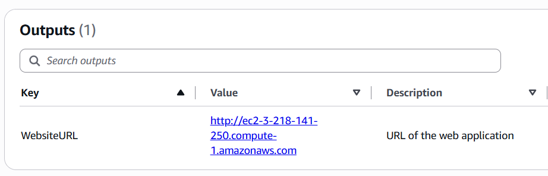
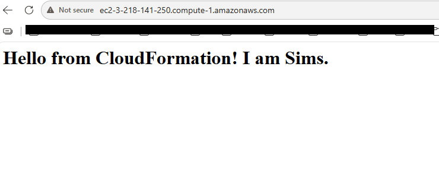
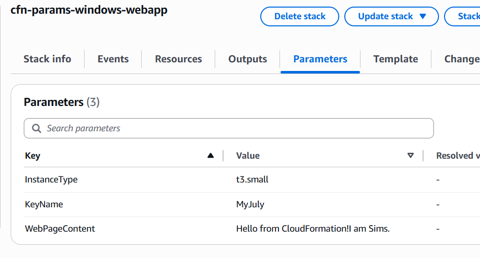
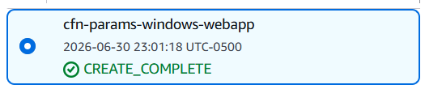
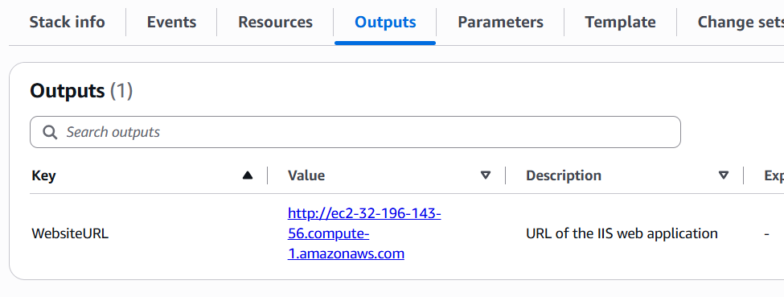
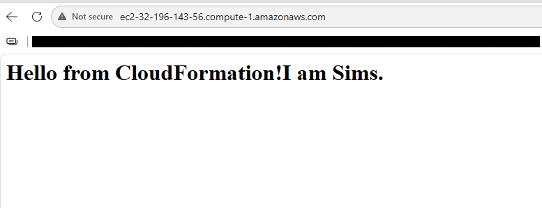

# AWS CloudFormation — Reusable Web App Templates
*Parameters Lab*

| | |
|---|---|
| **Student Name** | Sylvain S. Kamdem |
| **Course** | UCT Cloud / DevOps Bootcamp |
| **Instructor** | Valery Nyandja |
| **Assignment** | Reusable CloudFormation Web App Templates (Parameters Lab) |
| **AWS Region** | us-east-1 (N. Virginia) |
| **Date Submitted** | June 30, 2026 |

---

## Table of Contents

1. [Project Overview](#1-project-overview)
2. [How to Deploy a Parameterized CloudFormation Stack](#2-how-to-deploy-a-parameterized-cloudformation-stack)
3. [Stack 1 — Ubuntu Server Web App](#3-stack-1--ubuntu-server-web-app)
4. [Stack 2 — Windows Server Web App](#4-stack-2--windows-server-web-app)
5. [Ubuntu vs Windows — Side-by-Side Comparison](#5-ubuntu-vs-windows--side-by-side-comparison)
6. [Key CloudFormation Concepts](#6-key-cloudformation-concepts)
7. [AWS Resource Summary](#7-aws-resource-summary)
8. [Lessons Learned](#8-lessons-learned)
9. [Conclusion](#9-conclusion)

---

## 1. Project Overview

This document records the completion of the Reusable CloudFormation Web App Templates lab. The objective was to deploy a web application on two different operating systems — Ubuntu Server and Windows Server — using CloudFormation templates that are made reusable through parameters. All values such as instance type, key pair, and web page content were supplied as parameters at stack creation time through the AWS Management Console, rather than being hardcoded into the template.

### 1.1 What Makes a Template "Reusable"?

A hardcoded template always deploys the same instance type, the same key pair, and the same web page text. If you want to change anything, you must edit the JSON file. A parameterized template instead declares inputs at the top — the Parameters section — and the person deploying the stack fills in those values in the console wizard. This means the same JSON file can be used to deploy:

- A t3.micro in development and a t3.large in production
- Different key pairs for different team members
- Different web page content per environment or per customer
- Ubuntu Server or Windows Server, simply by choosing a different AMI parameter

### 1.2 Lab Summary

| | |
|---|---|
| **Stack 1** | Ubuntu Server — Apache web server, web page served via UserData |
| **Stack 2** | Windows Server — IIS web server, web page served via UserData |
| **Parameters used** | `InstanceType`, `KeyName`, `WebPageContent` (and AMI where applicable) |
| **Console only** | All steps performed in the AWS Management Console — no CLI |
| **Region** | us-east-1 |
| **Validation** | Open `WebsiteURL` from stack Outputs in a browser |

### 1.3 Parameters Used in This Lab

| Parameter Name | Type | Purpose |
|---|---|---|
| `InstanceType` | String | Sets the EC2 instance size (e.g. t3.micro) |
| `KeyName` | `AWS::EC2::KeyPair::KeyName` | The key pair used for SSH / RDP password decryption |
| `WebPageContent` | String | The HTML text displayed on the web page |
| `AmiId` (optional) | `AWS::EC2::Image::Id` | Makes the AMI selectable without editing the template |

---

## 2. How to Deploy a Parameterized CloudFormation Stack

The steps below are the same for both stacks. The key difference from a non-parameterized template is Step 4 — instead of skipping past the parameters screen, you fill in real values that customize the deployment.

1. **Open CloudFormation in the AWS Console** — Go to **Services > CloudFormation**. Confirm the region is `us-east-1` in the top-right selector.
2. **Click Create Stack > With new resources (standard)** — This opens the Create Stack wizard.
3. **Upload the template file** — Under *Specify template*, select **Upload a template file**. Click **Choose file** and select the correct `.json` template. Click **Next**.
4. **Fill in the parameters — this is what makes the template reusable** — The Parameters screen shows all declared inputs. Fill in `InstanceType`, `KeyName`, `WebPageContent`, and any other parameters. These values are injected into the template at deploy time. Click **Next**.
5. **Accept defaults on Configure stack options** — Leave all options at their defaults. Click **Next**.
6. **Review and Submit** — Review the parameter values shown in the summary. Click **Submit**. Status shows `CREATE_IN_PROGRESS`.
7. **Wait for CREATE_COMPLETE** — Refresh the Events tab until the status shows `CREATE_COMPLETE` (1–3 min Linux, 5–10 min Windows).
8. **Validate via the Outputs tab** — Click the Outputs tab and open the `WebsiteURL`. The page should display the custom content you supplied as a parameter.



---

## 3. Stack 1 — Ubuntu Server Web App

**⚙ Ubuntu 22.04 LTS — Apache Web Server — Deployed via CloudFormation Parameters**

This stack provisions an Ubuntu EC2 instance. A UserData shell script installs Apache and writes a custom HTML page whose content is pulled directly from the `WebPageContent` parameter value supplied during stack creation.

### 3.1 CloudFormation Template (JSON)

The following JSON template was used for the Ubuntu stack. Notice the Parameters section at the top — all customizable values are declared here, and referenced later using `{ "Ref": "ParameterName" }`.

```json
{
  "AWSTemplateFormatVersion": "2010-09-09",
  "Description": "Reusable Ubuntu Apache web server — all values supplied as parameters",
  "Parameters": {
    "InstanceType": {
      "Type": "String",
      "Default": "t3.micro",
      "AllowedValues": ["t2.micro", "t3.micro", "t3.small"],
      "Description": "EC2 instance size"
    },
    "KeyName": {
      "Type": "AWS::EC2::KeyPair::KeyName",
      "Description": "Existing EC2 key pair for SSH access"
    },
    "WebPageContent": {
      "Type": "String",
      "Default": "Hello from CloudFormation! Im Sim's.",
      "Description": "Text displayed on the web page"
    }
  },
  "Resources": {
    "UbuntuSG": {
      "Type": "AWS::EC2::SecurityGroup",
      "Properties": {
        "GroupDescription": "Allow HTTP and SSH",
        "SecurityGroupIngress": [
          { "IpProtocol": "tcp", "FromPort": 80, "ToPort": 80, "CidrIp": "0.0.0.0/0" },
          { "IpProtocol": "tcp", "FromPort": 22, "ToPort": 22, "CidrIp": "0.0.0.0/0" }
        ]
      }
    },
    "UbuntuInstance": {
      "Type": "AWS::EC2::Instance",
      "Properties": {
        "InstanceType": { "Ref": "InstanceType" },
        "ImageId": "ami-0c02fb55956c7d316",
        "KeyName": { "Ref": "KeyName" },
        "SecurityGroups": [{ "Ref": "UbuntuSG" }],
        "UserData": {
          "Fn::Base64": {
            "Fn::Join": ["", [
              "#!/bin/bash\n",
              "yum update -y\n",
              "yum install -y httpd\n",
              "systemctl start httpd\n",
              "systemctl enable httpd\n",
              "echo '<html><body><h1>", { "Ref": "WebPageContent" }, "</h1></body></html>'",
              " > /var/www/html/index.html\n"
            ]]
          }
        }
      }
    }
  },
  "Outputs": {
    "WebsiteURL": {
      "Value": { "Fn::Join": ["", ["http://", { "Fn::GetAtt": ["UbuntuInstance", "PublicDnsName"] }]] },
      "Description": "URL of the web application"
    }
  }
}
```

### 3.2 Parameters Supplied at Stack Creation

| | |
|---|---|
| **Stack Name** | `cfn-params-ubuntu-webapp` |
| **InstanceType** | t3.micro |
| **KeyName** | my-keypair-name |
| **WebPageContent** | Hello from CloudFormation! I am Sims. |
| **AMI** | Ubuntu Server 22.04 LTS — `ami-0c7217cdde317cfec` (us-east-1) |
| **Security Group** | HTTP port 80 open to `0.0.0.0/0`; SSH port 22 open to `0.0.0.0/0` |




### 3.3 How UserData Uses the Parameter

The `WebPageContent` parameter value flows into the running instance through the UserData script. CloudFormation substitutes the `Ref` at deploy time, so the script that runs on the EC2 instance looks like this:

```bash
#!/bin/bash
apt-get update -y
apt-get install -y apache2
systemctl start apache2
systemctl enable apache2
echo '<html><body><h1>Hello from CloudFormation! I am Sims</h1></body></html>' > /var/www/html/index.html
```

> 📝 **Note:** The text in bold above is exactly what was typed into the `WebPageContent` parameter field in the console. Changing that value and re-deploying the stack would produce a different page — no template editing required.

### 3.4 Validation — WebsiteURL in Browser

After the stack reached `CREATE_COMPLETE`, the `WebsiteURL` was copied from the Outputs tab and opened in a browser. The page displayed the custom web page content supplied as a parameter.




---

## 4. Stack 2 — Windows Server Web App

**⚙ Windows Server 2022 — IIS Web Server — Deployed via CloudFormation Parameters**

This stack provisions a Windows Server EC2 instance. A PowerShell-based UserData script installs IIS and writes a custom HTML page whose content is drawn from the `WebPageContent` parameter. The same JSON template structure is used — only the AMI ID and the UserData script language (PowerShell instead of bash) differ from the Ubuntu template.

### 4.1 CloudFormation Template (JSON)

```json
{
  "AWSTemplateFormatVersion": "2010-09-09",
  "Description": "Reusable Windows IIS web server — all values supplied as parameters",
  "Parameters": {
    "InstanceType": {
      "Type": "String",
      "Default": "t3.small",
      "AllowedValues": ["t3.small", "t3.medium"],
      "Description": "EC2 instance size (Windows needs at least t3.small)"
    },
    "KeyName": {
      "Type": "AWS::EC2::KeyPair::KeyName",
      "Description": "Existing EC2 key pair (used to decrypt Windows password)"
    },
    "WebPageContent": {
      "Type": "String",
      "Default": "Hello from CloudFormation! I am Sims.",
      "Description": "Text displayed on the IIS web page"
    }
  },
  "Resources": {
    "WindowsSG": {
      "Type": "AWS::EC2::SecurityGroup",
      "Properties": {
        "GroupDescription": "Allow HTTP",
        "SecurityGroupIngress": [
          { "IpProtocol": "tcp", "FromPort": 80, "ToPort": 80, "CidrIp": "0.0.0.0/0" }
        ]
      }
    },
    "WindowsInstance": {
      "Type": "AWS::EC2::Instance",
      "Properties": {
        "InstanceType": { "Ref": "InstanceType" },
        "ImageId": "ami-09639480113b0df96",
        "KeyName": { "Ref": "KeyName" },
        "SecurityGroups": [{ "Ref": "WindowsSG" }],
        "UserData": {
          "Fn::Base64": {
            "Fn::Join": ["", [
              "<powershell>\nInstall-WindowsFeature -Name Web-Server -IncludeManagementTools\n",
              "$content = '<html><body><h1>", { "Ref": "WebPageContent" }, "</h1></body></html>'\n",
              "Set-Content -Path C:\\inetpub\\wwwroot\\iisstart.htm -Value $content\n",
              "</powershell>"
            ]]
          }
        }
      }
    }
  },
  "Outputs": {
    "WebsiteURL": {
      "Value": { "Fn::Join": ["", ["http://", { "Fn::GetAtt": ["WindowsInstance", "PublicDnsName"] }]] },
      "Description": "URL of the IIS web application"
    }
  }
}
```

### 4.2 Parameters Supplied at Stack Creation

| | |
|---|---|
| **Stack Name** | `cfn-params-windows-webapp` |
| **InstanceType** | t3.small |
| **KeyName** | [my-keypair-name] |
| **WebPageContent** | Hello from CloudFormation! I am Sims. |
| **AMI** | Windows Server 2022 Base — `ami-0f9c44e98edf38a2b` (us-east-1) |
| **Security Group** | HTTP port 80 open to `0.0.0.0/0` |




### 4.3 How UserData Uses the Parameter (PowerShell)

The PowerShell script that runs on first boot with the `WebPageContent` value substituted looks like this:

```powershell
<powershell>
Install-WindowsFeature -Name Web-Server -IncludeManagementTools
$content = '<html><body><h1>Hello from CloudFormation! I am Sims.</h1></body></html>'
Set-Content -Path C:\inetpub\wwwroot\iisstart.htm -Value $content
</powershell>
```

> 📝 **Note:** Windows UserData uses `<powershell>` tags instead of `#!/bin/bash`. The EC2Launch v2 agent detects these tags and runs the script as PowerShell on first boot. IIS installation can take 5–8 minutes after the instance reaches running state.

### 4.4 Validation — WebsiteURL in Browser

After the stack reached `CREATE_COMPLETE` and IIS finished installing (approximately 5–8 minutes after `CREATE_COMPLETE`), the `WebsiteURL` was opened from the Outputs tab. The page displayed the custom content supplied as a parameter.




---

## 5. Ubuntu vs Windows — Side-by-Side Comparison

| Aspect | Ubuntu Stack | Windows Stack |
|---|---|---|
| **Stack name** | `cfn-params-ubuntu-webapp` | `cfn-params-windows-webapp` |
| **OS** | Ubuntu Server 22.04 LTS | Windows Server 2022 |
| **Web server** | Apache2 (httpd) | IIS (Web-Server feature) |
| **UserData language** | Bash shell script | PowerShell (`<powershell>` tags) |
| **Install command** | `yum install -y httpd` | `Install-WindowsFeature Web-Server` |
| **Web root path** | `/var/www/html/index.html` | `C:\inetpub\wwwroot\iisstart.htm` |
| **InstanceType used** | t3.micro | t3.small |
| **Time to complete** | ~2 minutes | ~8–10 minutes |
| **Parameters shared** | InstanceType, KeyName, WebPageContent | InstanceType, KeyName, WebPageContent |
| **Validation method** | WebsiteURL in browser | WebsiteURL in browser |

---

## 6. Key CloudFormation Concepts

| Concept | Explanation |
|---|---|
| **Parameters** | The Parameters section at the top of a template declares all the inputs the user can supply at deploy time. Each parameter has a Type, optional Default, optional AllowedValues, and a Description shown in the console. |
| **Ref** | `{ "Ref": "ParameterName" }` is how a template reads a parameter value and inserts it into a resource property. The same syntax also references other resources in the template. |
| **Fn::Join** | Concatenates a list of strings into one. Used in UserData to build the full shell script by joining static lines with the dynamic parameter value (`WebPageContent`). |
| **Fn::Base64** | Base64-encodes the UserData script. EC2 requires UserData to be Base64-encoded — CloudFormation handles this automatically with this function. |
| **Fn::GetAtt** | Retrieves an attribute of a resource after it is created, such as the `PublicDnsName` of an EC2 instance, which is used to build the `WebsiteURL` output. |
| **Outputs** | The Outputs section exposes values from the stack after creation — such as the `WebsiteURL` — visible in the Outputs tab of the CloudFormation console and consumable by other stacks. |
| **AllowedValues** | An optional constraint on a parameter that restricts the choices to a defined list. CloudFormation validates the supplied value against this list before creating the stack. |
| **Default** | A parameter Default value is pre-filled in the console parameters screen. The user can accept it or override it. It makes templates more beginner-friendly. |

---

## 7. AWS Resource Summary

The table below lists every resource created during this lab. All resources are in the `us-east-1` region and follow the assignment naming convention.

| Resource Type | Name / ID | Notes |
|---|---|---|
| CF Stack | `cfn-params-ubuntu-webapp` | Ubuntu Apache — `CREATE_COMPLETE` |
| EC2 Instance | Ubuntu t3.micro | Terminated after validation |
| Security Group | UbuntuSG (auto-named) | HTTP 80 + SSH 22 |
| CF Stack | `cfn-params-windows-webapp` | Windows IIS — `CREATE_COMPLETE` |
| EC2 Instance | Windows t3.small | Terminated after validation |
| Security Group | WindowsSG (auto-named) | HTTP 80 only |
| Key Pair | [your-keypair-name] | Used for both stacks |

---

## 8. Lessons Learned

- **Parameters are what make CloudFormation templates truly reusable.** The same template can deploy to dev, staging, and production simply by supplying different parameter values — no file editing, no duplication of templates.
- **AllowedValues adds safety.** Restricting `InstanceType` to a list of approved sizes prevents accidental deployment of expensive instance types, which is a best practice in team and production environments.
- **UserData + Ref is a powerful combination.** Being able to inject a parameter value directly into a shell or PowerShell script means that infrastructure and application content can be customized at the same time, in the same stack deployment.
- **Windows requires more time and a larger instance.** Windows stacks consistently take longer to create and need at least t3.small to avoid performance issues, while Ubuntu works fine on t3.micro. Knowing this upfront avoids troubleshooting delays.
- **Outputs make stacks self-documenting.** Instead of hunting for the IP address in EC2, the `WebsiteURL` in the Outputs tab gives a ready-to-use link immediately after the stack completes — the intended handoff mechanism for CloudFormation-deployed applications.

---

## 9. Conclusion

Both stacks were successfully deployed and validated. The Ubuntu stack deployed an Apache web server using a bash UserData script, and the Windows stack deployed an IIS web server using a PowerShell UserData script. In both cases, the web page content was supplied as a parameter at deploy time — demonstrating that the same template can produce different results without any changes to the JSON file.

This lab reinforced a core Infrastructure as Code principle: separate configuration from code. The template defines the infrastructure structure; the parameters carry the values. This separation is what makes CloudFormation templates reusable across environments, teams, and use cases.
