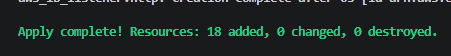
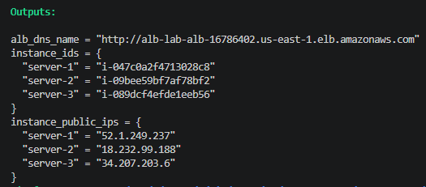
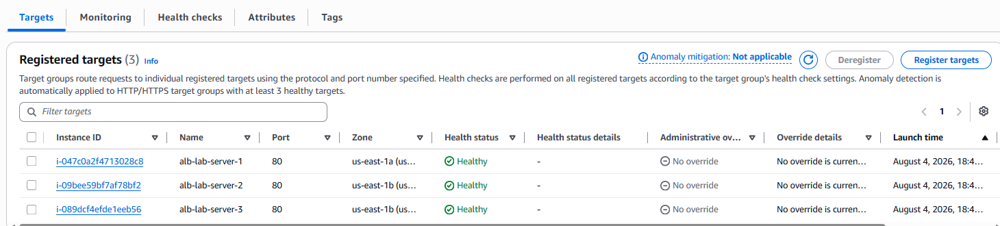
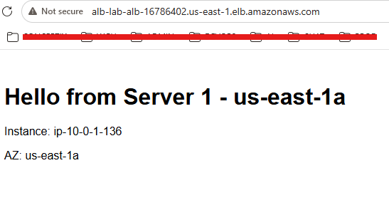
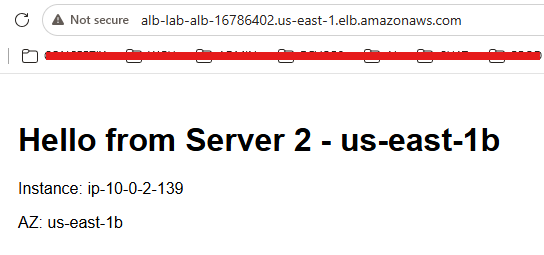
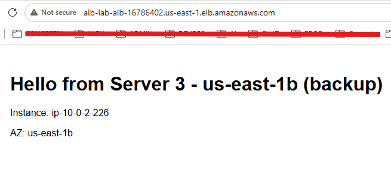
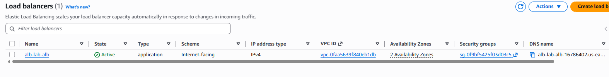
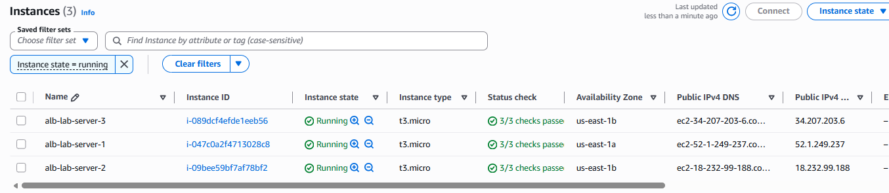

# AWS Application Load Balancer
*3 Ubuntu EC2 Instances — Terraform IaC Deployment*

| | |
|---|---|
| **Student Name** | Sylvain Simo Kamdem |
| **Course** | UCT Cloud / DevOps Bootcamp |
| **Instructor** | Valery Nyandja |
| **Assignment** | AWS ALB with 3 Ubuntu EC2 Instances |
| **IaC Tool** | Terraform (HashiCorp) |
| **AWS Region** | us-east-1 (N. Virginia) |
| **Date Submitted** | August 4, 2026 |

---

## Table of Contents

1. [Project Overview](#1-project-overview)
2. [Prerequisites & Environment Setup](#2-prerequisites--environment-setup)
3. [Terraform Configuration Files](#3-terraform-configuration-files)
4. [Deployment Steps](#4-deployment-steps)
5. [Validation — Verify Load Balancing in Browser](#5-validation--verify-load-balancing-in-browser)
6. [AWS Resource Summary](#6-aws-resource-summary)
7. [Cleanup — Destroy All Resources](#7-cleanup--destroy-all-resources)
8. [Lessons Learned](#8-lessons-learned)
9. [Conclusion](#9-conclusion)

---

## 1. Project Overview

This document records the deployment of a highly available web application on AWS using Terraform as the Infrastructure as Code (IaC) tool. The architecture consists of three Ubuntu EC2 instances running Apache web servers, placed behind an Application Load Balancer (ALB). Traffic from users is distributed across all three instances, and each instance serves a unique message so that load balancing behavior can be verified directly in a browser.

All infrastructure was defined in Terraform configuration files and deployed with a single `terraform apply` command — no manual clicking in the AWS Console.

### 1.1 What is an Application Load Balancer?

An Application Load Balancer (ALB) is an AWS managed service that receives incoming HTTP/HTTPS traffic and distributes it across a pool of backend servers called a Target Group. Key benefits include:

- **High availability** — traffic is spread across multiple servers and Availability Zones
- **Health checks** — the ALB automatically stops sending traffic to unhealthy instances
- **Single entry point** — users only need one URL (the ALB DNS name), never individual server IPs
- **Scalability** — add or remove instances from the target group without downtime

### 1.2 What is Terraform?

Terraform is an open-source IaC tool by HashiCorp. Instead of clicking through the AWS Console, you write `.tf` files that describe every resource you want, and Terraform creates, modifies, or destroys them to match your code. Key concepts used in this lab:

| Concept | What it does |
|---|---|
| **terraform init** | Downloads the AWS provider plugin — run once per project |
| **terraform plan** | Shows a preview of every resource Terraform will create/change/destroy |
| **terraform apply** | Actually creates the resources in AWS |
| **terraform destroy** | Deletes all resources defined in the `.tf` files — avoids surprise charges |
| **resource** | A block in `.tf` that defines one AWS resource (e.g. an EC2 instance) |
| **variable** | A reusable input value (like a parameter) that makes code flexible |
| **output** | A value Terraform prints after apply — used here to show the ALB DNS name |
| **.tfvars file** | A file containing variable values — keeps secrets and config separate from code |

### 1.3 Architecture Diagram

The following diagram illustrates the deployed architecture:

```
                         Internet / Browser
                                 │
                             HTTP :80
                                 │
                  Application Load Balancer (ALB)
                     ╱            │            ╲
                EC2 #1         EC2 #2         EC2 #3
             (us-east-1a)   (us-east-1b)   (us-east-1b)
             Apache│Server1 Apache│Server2 Apache│Server3
                     ╲            │            ╱
                  Target Group (HTTP :80, health check /)

                          VPC — us-east-1
```

---

## 2. Prerequisites & Environment Setup

### 2.1 Tools Required

- AWS account with EC2, VPC, and ALB permissions
- Terraform installed (v1.0 or later) — terraform.io/downloads
- AWS CLI installed and configured with your credentials
- A text editor (VS Code recommended)
- An existing EC2 key pair in us-east-1 (for SSH access if needed)

### 2.2 Configure AWS Credentials

Before running any Terraform commands, configure the AWS CLI with your IAM credentials:

```bash
aws configure
# Enter when prompted:
AWS Access Key ID: [access-key-id]
AWS Secret Access Key: [secret-access-key]
Default region name: us-east-1
Default output format: json
```

### 2.3 Project Folder Structure

Create a folder for this project and organize the Terraform files as follows:

```
alb-lab/
├── main.tf            # VPC, subnets, security groups, EC2 instances
├── alb.tf              # Target group, ALB, listener
├── variables.tf         # Variable declarations
├── terraform.tfvars      # Variable values (key pair name, region, etc.)
└── outputs.tf            # ALB DNS name output
```

---

## 3. Terraform Configuration Files

The infrastructure is split across five files for clarity and maintainability. Each file is shown in full below with explanatory comments.

### File 1 of 5 — `variables.tf`

Declares all input variables. Values are supplied in `terraform.tfvars` so the code stays generic.

```hcl
variable "aws_region" {
  description = "AWS region to deploy resources"
  type        = string
  default     = "us-east-1"
}

variable "key_name" {
  description = "EC2 key pair name for SSH access"
  type        = string
}

variable "instance_type" {
  description = "EC2 instance type"
  type        = string
  default     = "t3.micro"
}

variable "ami_id" {
  description = "Ubuntu 26.04 LTS AMI ID for us-east-1"
  type        = string
  default     = "ami-0b6d9d3d33ba97d99"
}

variable "project_name" {
  description = "Prefix applied to all resource names"
  type        = string
  default     = "alb-lab"
}
```

### File 2 of 5 — `terraform.tfvars`

Supplies the actual values for each variable.

```hcl
aws_region     = "us-east-1"
key_name       = "[keypair-name]"
instance_type  = "t3.micro"
ami_id         = "ami-0b6d9d3d33ba97d99" # Ubuntu 26.04 LTS — us-east-1
project_name   = "alb-lab"
```

### File 3 of 5 — `main.tf` (Provider, VPC, Subnets, Security Groups, EC2)

Defines the core network infrastructure and the three EC2 web servers. Each instance uses a `user_data` script to install Apache and serve a unique message.

```hcl
# ── Provider ──────────────────────────────────────────────────────────
terraform {
  required_providers {
    aws = {
      source  = "hashicorp/aws"
      version = "~> 5.0"
    }
  }
}

provider "aws" {
  region = var.aws_region
}

# ── VPC ───────────────────────────────────────────────────────────────
resource "aws_vpc" "main" {
  cidr_block           = "10.0.0.0/16"
  enable_dns_hostnames = true
  enable_dns_support   = true
  tags                 = { Name = "${var.project_name}-vpc" }
}

# ── Internet Gateway ─────────────────────────────────────────────────
resource "aws_internet_gateway" "igw" {
  vpc_id = aws_vpc.main.id
  tags   = { Name = "${var.project_name}-igw" }
}

# ── Public Subnets (2 AZs minimum for ALB requirement) ─────────────────
resource "aws_subnet" "public_a" {
  vpc_id                  = aws_vpc.main.id
  cidr_block              = "10.0.1.0/24"
  availability_zone       = "us-east-1a"
  map_public_ip_on_launch = true
  tags                    = { Name = "${var.project_name}-subnet-a" }
}

resource "aws_subnet" "public_b" {
  vpc_id                  = aws_vpc.main.id
  cidr_block              = "10.0.2.0/24"
  availability_zone       = "us-east-1b"
  map_public_ip_on_launch = true
  tags                    = { Name = "${var.project_name}-subnet-b" }
}

# ── Route Table ──────────────────────────────────────────────────────
resource "aws_route_table" "public" {
  vpc_id = aws_vpc.main.id

  route {
    cidr_block = "0.0.0.0/0"
    gateway_id = aws_internet_gateway.igw.id
  }

  tags = { Name = "${var.project_name}-rt" }
}

resource "aws_route_table_association" "a" {
  subnet_id      = aws_subnet.public_a.id
  route_table_id = aws_route_table.public.id
}

resource "aws_route_table_association" "b" {
  subnet_id      = aws_subnet.public_b.id
  route_table_id = aws_route_table.public.id
}

# ── Security Group: EC2 instances ───────────────────────────────────
# Allow HTTP from ALB only; SSH from anywhere for lab troubleshooting
resource "aws_security_group" "ec2_sg" {
  name        = "${var.project_name}-ec2-sg"
  description = "Allow HTTP from ALB and SSH"
  vpc_id      = aws_vpc.main.id

  ingress {
    from_port       = 80
    to_port         = 80
    protocol        = "tcp"
    security_groups = [aws_security_group.alb_sg.id]
  }

  ingress {
    from_port   = 22
    to_port     = 22
    protocol    = "tcp"
    cidr_blocks = ["0.0.0.0/0"]
  }

  egress {
    from_port   = 0
    to_port     = 0
    protocol    = "-1"
    cidr_blocks = ["0.0.0.0/0"]
  }

  tags = { Name = "${var.project_name}-ec2-sg" }
}

# ── Security Group: ALB ─────────────────────────────────────────────
resource "aws_security_group" "alb_sg" {
  name        = "${var.project_name}-alb-sg"
  description = "Allow HTTP from internet"
  vpc_id      = aws_vpc.main.id

  ingress {
    from_port   = 80
    to_port     = 80
    protocol    = "tcp"
    cidr_blocks = ["0.0.0.0/0"]
  }

  egress {
    from_port   = 0
    to_port     = 0
    protocol    = "-1"
    cidr_blocks = ["0.0.0.0/0"]
  }

  tags = { Name = "${var.project_name}-alb-sg" }
}

# ── EC2 Instances (3 web servers) ───────────────────────────────────
locals {
  servers = {
    "server-1" = { az = "us-east-1a", subnet = aws_subnet.public_a.id,
      msg = "Hello from Server 1 — us-east-1a" }
    "server-2" = { az = "us-east-1b", subnet = aws_subnet.public_b.id,
      msg = "Hello from Server 2 — us-east-1b" }
    "server-3" = { az = "us-east-1b", subnet = aws_subnet.public_b.id,
      msg = "Hello from Server 3 — us-east-1b (backup)" }
  }
}

resource "aws_instance" "web" {
  for_each = local.servers

  ami                     = var.ami_id
  instance_type           = var.instance_type
  key_name                = var.key_name
  subnet_id               = each.value.subnet
  vpc_security_group_ids  = [aws_security_group.ec2_sg.id]

  user_data = <<-EOF
    #!/bin/bash
    apt-get update -y
    apt-get install -y apache2
    systemctl start apache2
    systemctl enable apache2
    echo "<html><body style=\"font-family:Arial;padding:40px;\">
    <h1>${each.value.msg}</h1>
    <p>Instance: $(hostname)</p>
    <p>AZ: ${each.value.az}</p>
    </body></html>" > /var/www/html/index.html
  EOF

  tags = { Name = "${var.project_name}-${each.key}" }
}
```

### File 4 of 5 — `alb.tf` (Target Group, ALB, Listener, Attachments)

Creates the Target Group, the ALB itself, the HTTP listener on port 80, and attaches all three EC2 instances to the target group.

```hcl
# ── Target Group ─────────────────────────────────────────────────────
resource "aws_lb_target_group" "web_tg" {
  name     = "${var.project_name}-tg"
  port     = 80
  protocol = "HTTP"
  vpc_id   = aws_vpc.main.id

  health_check {
    path                = "/"
    protocol            = "HTTP"
    matcher             = "200"
    interval            = 30
    timeout             = 5
    healthy_threshold   = 2
    unhealthy_threshold = 2
  }

  tags = { Name = "${var.project_name}-tg" }
}

# ── Attach EC2 instances to Target Group ────────────────────────────
resource "aws_lb_target_group_attachment" "web" {
  for_each          = aws_instance.web
  target_group_arn  = aws_lb_target_group.web_tg.arn
  target_id         = each.value.id
  port              = 80
}

# ── Application Load Balancer ───────────────────────────────────────
resource "aws_lb" "alb" {
  name               = "${var.project_name}-alb"
  internal           = false
  load_balancer_type = "application"
  security_groups    = [aws_security_group.alb_sg.id]
  subnets = [
    aws_subnet.public_a.id,
    aws_subnet.public_b.id
  ]

  tags = { Name = "${var.project_name}-alb" }
}

# ── Listener: forward HTTP :80 to target group ──────────────────────
resource "aws_lb_listener" "http" {
  load_balancer_arn = aws_lb.alb.arn
  port              = 80
  protocol          = "HTTP"

  default_action {
    type             = "forward"
    target_group_arn = aws_lb_target_group.web_tg.arn
  }
}
```

### File 5 of 5 — `outputs.tf`

Prints the ALB DNS name after `terraform apply` completes. This is the URL used to verify load balancing in the browser.

```hcl
output "alb_dns_name" {
  description = "Open this URL in a browser to verify load balancing"
  value       = "http://${aws_lb.alb.dns_name}"
}

output "instance_ids" {
  description = "IDs of the three web server instances"
  value       = { for k, v in aws_instance.web : k => v.id }
}

output "instance_public_ips" {
  description = "Public IPs of the three web servers"
  value       = { for k, v in aws_instance.web : k => v.public_ip }
}
```

---

## 4. Deployment Steps

With all five files saved in the project folder, run the following Terraform commands in order from a terminal opened in that folder.

**1. Initialize Terraform** — Downloads the AWS provider plugin. Run once per project.

```bash
cd alb-lab
terraform init
```

**2. Preview the deployment plan** — Shows every resource Terraform will create before anything is built. Review carefully.

```bash
terraform plan
```

Expected output: plan shows approximately 15 resources to add — VPC, IGW, 2 subnets, route table, 2 route table associations, 2 security groups, 3 EC2 instances, target group, 3 target group attachments, ALB, listener.

**3. Apply the configuration** — Creates all resources in AWS. Type `yes` when prompted to confirm.

```bash
terraform apply -auto-approve
```

> 📝 **Note:** This step takes 3–5 minutes. The ALB takes the longest — AWS provisions it in the background after EC2 instances are ready.



**4. Note the ALB DNS name from Outputs** — After apply completes, Terraform prints the `alb_dns_name` output. Copy that URL.

```bash
# Example output after apply:
Outputs:
alb_dns_name = "http://alb-lab-alb-1234567890.us-east-1.elb.amazonaws.com"
```



**5. Wait for health checks to pass** — Wait 2–3 minutes for Apache to finish installing on all instances. The ALB will only send traffic to healthy instances.

Verify health in the AWS Console: **EC2 > Target Groups > select alb-lab-tg > Targets** tab. All three instances should show "healthy".



---

## 5. Validation — Verify Load Balancing in Browser

Open the ALB DNS name URL from the Terraform output in a web browser. Each refresh may show a different server message, confirming that the ALB is distributing traffic across all three instances.

> 📝 **Note:** Browsers cache connections, so you may not see a different server on every single refresh. Try opening the URL in a private/incognito window, or use Ctrl+Shift+R (hard refresh) to bypass the cache.

### 5.1 Browser Verification

- Open `http://[alb-dns-name]` in a browser
- You should see: "Hello from Server 1 — us-east-1a"
- Refresh the page — you should eventually see Server 2 and Server 3 messages
- Each response confirms which backend instance handled the request





### 5.2 Console Verification

- **EC2 > Load Balancers** — ALB shows "active" state
- **EC2 > Target Groups > Targets** — all 3 instances show "healthy"
- **EC2 > Instances** — all 3 instances in "running" state with correct names




---

## 6. AWS Resource Summary

Terraform created the following resources in `us-east-1`. All resources are tagged with the `project_name` prefix for easy identification.

| Resource Type | Name / Tag | Details |
|---|---|---|
| VPC | alb-lab-vpc | CIDR 10.0.0.0/16, DNS enabled |
| Internet Gateway | alb-lab-igw | Attached to VPC |
| Subnet | alb-lab-subnet-a | 10.0.1.0/24 — us-east-1a |
| Subnet | alb-lab-subnet-b | 10.0.2.0/24 — us-east-1b |
| Route Table | alb-lab-rt | Default route → IGW |
| Security Group | alb-lab-alb-sg | Inbound HTTP :80 from internet |
| Security Group | alb-lab-ec2-sg | Inbound HTTP from ALB SG; SSH :22 |
| EC2 Instance | alb-lab-server-1 | us-east-1a, t3.micro, Apache |
| EC2 Instance | alb-lab-server-2 | us-east-1b, t3.micro, Apache |
| EC2 Instance | alb-lab-server-3 | us-east-1b, t3.micro, Apache |
| Target Group | alb-lab-tg | HTTP :80, health check / |
| ALB | alb-lab-alb | Internet-facing, 2 subnets |
| ALB Listener | (auto-named) | HTTP :80 → forward to target group |

---

## 7. Cleanup — Destroy All Resources

When the lab is complete, destroy all resources to avoid ongoing AWS charges. Terraform removes everything it created in the correct order automatically.

```bash
terraform destroy
# Type 'yes' and press Enter to confirm
```

Expected output: Terraform will list all resources to destroy, then confirm "Destroy complete!"

> 📝 **Note:** Always run `terraform destroy` when finished with a lab. ALBs, EC2 instances, and NAT Gateways all incur hourly charges.

---

## 8. Lessons Learned

- **Terraform's `for_each` makes managing multiple similar resources clean.** Instead of writing three identical EC2 resource blocks, one resource block with `for_each` creates all three servers, each with its own unique message and AZ assignment.
- **Security groups control the traffic chain.** The EC2 instances only accept HTTP traffic from the ALB security group, not from the internet directly. This means the web application is only reachable through the ALB — exactly what the assignment requires.
- **ALBs require at least two subnets in different AZs.** This is a hard AWS requirement, not optional. Subnets in us-east-1a and us-east-1b were created to satisfy this.
- **Health checks are critical.** The ALB only forwards traffic to instances that pass the health check. If Apache isn't running yet (UserData still executing), the instance shows "unhealthy" and receives no traffic — protecting users from errors.
- **Outputs eliminate manual lookups.** Without the `alb_dns_name` output, finding the load balancer URL would require navigating through the console. Terraform outputs surface exactly what you need right in the terminal.
- **`terraform destroy` is as important as `terraform apply`.** Infrastructure as Code means the entire environment can be recreated from code — so destroying it when done is safe and cost-efficient.

---

## 9. Conclusion

The lab was completed successfully. Three Ubuntu EC2 instances running Apache were deployed behind an Application Load Balancer using Terraform. Each instance serves a unique HTML page, and refreshing the ALB URL in a browser shows different server messages, confirming that the ALB is distributing traffic across all three backends.

Using Terraform instead of the AWS Console demonstrated the core advantage of Infrastructure as Code: the entire architecture — VPC, subnets, security groups, EC2 instances, target group, ALB, and listener — was defined in approximately 150 lines of code and deployed in a single command. Destroying it required one command. Recreating it identically requires the same one command.
